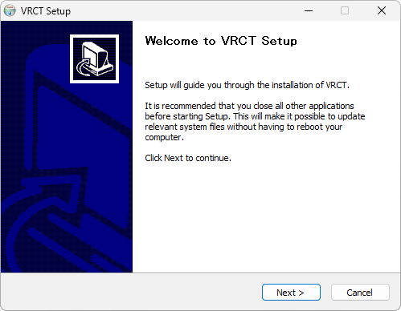
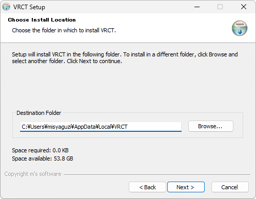

# Installation

You can install VRCT by downloading and running the setup.exe file. Please follow the steps below to complete the installation.

## Installation Steps
1. Download the setup.exe file from the Booth or GitHub.
    - [Booth](https://misyaguziya.booth.pm/items/5155325)
    - [GitHub Releases](https://github.com/misyaguziya/VRCT/releases/latest)

2. Double-click the downloaded setup.exe file to run it.

:::tip[tip]
When running the setup.exe file, you may see a security warning, which is normal. If the warning appears, click "More info" and then select "Run anyway".
:::

3. Follow the instructions provided by the installer to proceed with the installation.  
    **Step 1**  
      
    **Step 2**  
      
    **Step 3**  
      
    :::tip[tip]
    You can change the UI language later.
    :::

    **Step 4**  
      
    **Step 5**  
      
    If you have already installed the application, you will be prompted to confirm whether to overwrite the existing installation.  
    **Step 6**  
      
    **Step 7**  
      
    **Step 8**  
    

4. After the installation is complete, click the "Finish" button to close the installer.  