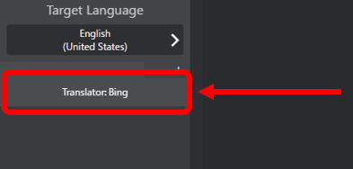
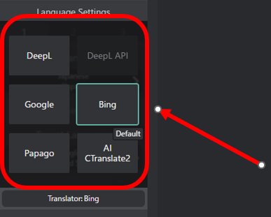

# Initial Setup
This guide will walk you through the initial setup process of VRCT after installation.

## Step 1: Launch VRCT
After installing VRCT, locate the VRCT application icon on your desktop or in your start menu and double-click it to launch the application.

## Step 2: Configure VRChat OSC Settings
To enable VRCT to communicate with VRChat, you need to configure the OSC (Open Sound Control) settings in VRChat. Follow these steps:
1. Open VRChat and go to the Expression Menu.
2. Navigate to "Option" -> "OSC" -> "Enable".  

3. Enable the "OSC" option by toggling the switch.  

## Step 3: Configure Basic Settings
When launching VRCT, default settings will be automatically applied. Please review and modify the following settings as needed:

### Language Settings
    Select the language you speak and the language you want to translate to.
    1. **Your Language**: Select the language you will be speaking.
    2. **Target Language**: Select the language you want to be translated into.

    
### Microphone and Speaker Settings
    Choose the microphone and speaker devices you want VRCT to use for voice translation.  
    1. Open the Config Window by clicking on the "⚙️Configure" button.  
      
    2. Select the Device Tab.  
      
    3. **Mic Device**: Select the microphone device you will use for input.  
    4. **Speaker Device**: Select the speaker device you will use for output.  
      

### Translation Engine Settings
    Select the languages you want to translate between during conversations.  
    1. Click the Transcription Engine list.  
      
    2. Choose the desired transcription engine.  
      