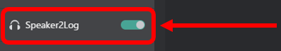

# Receive Message with Translation

This guide will walk you through the process of receiving messages with translation in VRCT.

## Step 1: Enable translation features.
    In the main window of VRCT, switch the "Translation" toggle to on.  
    

    :::tip[tip]
    If you do not enable the translation feature, messages will be shown without translation.
    :::

## Step 2: Receive a message.

1. **Using the speaker device**  
    You can receive a voice message through your selected speaker device. VRCT will recognize a voice message, convert it to text, show it in the chat history area.  
    

    :::tip[tip]
    Before receiving a message, make sure the microphone and speaker you want to use are correctly selected in the VRCT settings.
    :::

2. **Check the received message**  
    After receiving the message, you can check it in the chat history area of the main window. The translated message will be displayed along with the original message.  
    

:::warning[warning]
If you change the speaker device in Windows while VRCT is transcribing the speaker, VRCT may freeze.  
If you want to change it, please stop the speaker transcription function first.
:::