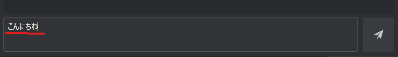
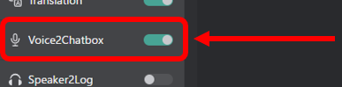

# Send Message with Translation
This guide will walk you through the process of sending messages with translation in VRCT.

## Enable translation features.
   In the main window of VRCT, switch the "Translation" toggle to on.  
   

    :::tip[tip]
    If you do not enable the translation feature, messages will be sent without translation.
    :::

## Send a message.
There are two ways to send a message.

1. **Using the chat input field**  
   You can send a message by typing it into the chat input field in the main window of VRCT and pressing the Enter key (or Send button).  
   

2. **Using the microphone**  
   You can also send a message using your voice with the microphone. VRCT will recognize your speech, convert it to text, and send it.  
   
    :::tip[tip]
    Before sending a message, make sure the microphone and speaker you want to use are correctly selected in the VRCT settings.
    :::

3. **Check the sent message**  
   After sending the message, you can check it in the chat history area of the main window. The translated message will be displayed along with the original message.  
   