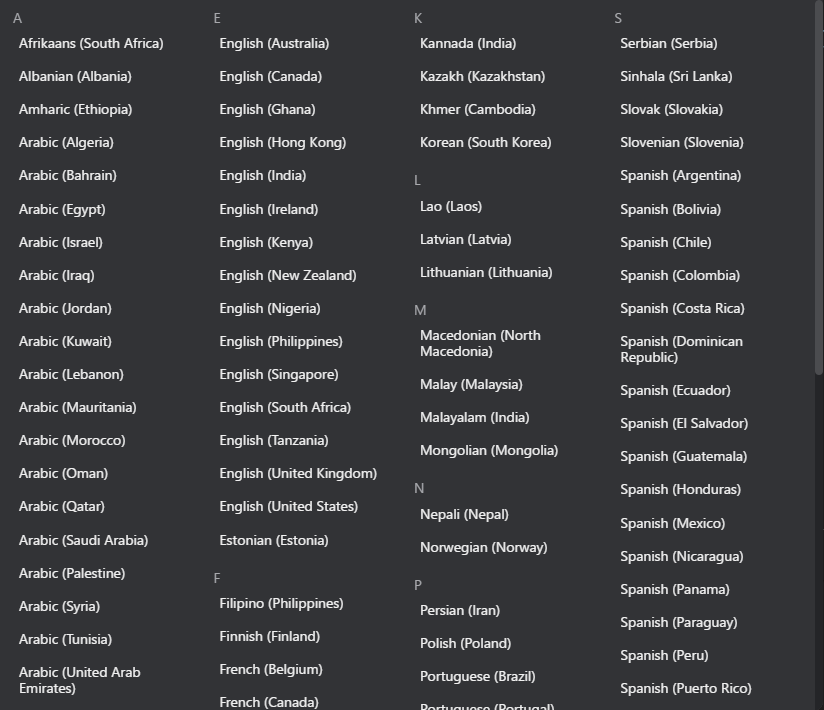

# Real-time Translation

VRCT provides real-time translation capabilities to help you communicate across language barriers.

## Overview

The translation feature automatically translates your send messages and received messages between different languages.

## How to Use

### Enable Translation

1. Locate the **Translation** toggle switch in the main window  
  
2. Click to enable translation functionality  
  
3. When enabled, all sent and received messages will be translated

:::tip[Tip]
You can quickly toggle translation on/off without losing your language settings.
:::

### Select Languages

1. **Your Language**: Set the language you speak or type in
2. **Target Language**: Set the language you want to translate to

Click on the language area to open the language selection menu and choose your desired language.

### Swap Languages

Click the swap button between the language settings to quickly switch your language and target language.

## Translation Flow

### Sending Messages
Already covered in [Tutorial Send Message](../send-message) guide, but here is a brief overview:

1. Type your message in your language
2. VRCT automatically translates it to the target language
3. Both original and translated text are displayed in the chat history
4. The translated message is sent to VRChat chatbox via OSC

### Receiving Messages
Already covered in [Tutorial Receive Message](../receive-message) guide, but here is a brief overview:

1. When others speak (captured via speaker transcription)
2. VRCT transcribes the audio to text
3. The transcribed text is automatically translated to your language
4. Both original and translated text are displayed in the chat history

## Supported Languages

VRCT supports a wide range of languages including:

- English
- Japanese
- Chinese (Simplified/Traditional)
- Korean
- Spanish
- French
- German
- Italian
- Portuguese
- Russian
- Arabic
- Thai
- Vietnamese
- And many more...

:::info[Info]
Available languages may vary depending on the selected translation engine.  
Check the [Translation Engine Selection](./translation-engines) guide for more details.
:::

## Features

### Multiple Language Translation
Translate messages to multiple target languages simultaneously. See the [Multiple Target Languages](./multi-target-language) guide for details.

### Translation History

All translations are saved in the chat history, allowing you to review previous conversations.

### Customizable Translation Quality

Different translation engines offer different quality and features. You can choose the best engine for your needs in the [Translation Engine Selection](./translation-engines) guide.

## Tips for Better Translation
- Improve transcription accuracy
    1. **Speak Clearly**: For voice input, speaking clearly improves transcription accuracy
    2. **Check Around Noise**: For speaker input, minimize background noise for better transcription accuracy
- Improve translation quality
    1. **Use Simple Sentences**: Shorter, simpler sentences generally translate better
    2. **Choose Appropriate Engines**: Different engines perform better with different language pairs

## Troubleshooting

### Translation Not Working

- Check if translation toggle is enabled
- Verify that both languages are properly selected

### Poor Translation Quality

- Try switching to a different translation engine
- Simplify your message

## Related Features

- [Multiple Target Languages](./multi-target-language) - Translate to multiple languages at once
- [Translation Engine Selection](./translation-engines) - Choose the best translation engine
- [Send Message](./send-message) - Learn how to send translated messages
- [Receive Message](./receive-message) - Learn how to receive translated messages
