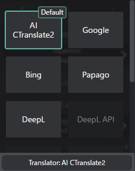

# Translation Engines

VRCT supports multiple translation engines, each with its own strengths and characteristics. You can select the best engine for your needs.

## Overview
Different translation engines offer various advantages in terms of speed, quality, language support, and privacy. VRCT allows you to choose from a range of engines, including local AI models and cloud-based services.

## How to Select Translation Engine

1. In the main window, click on the translation engine name area
2. A selection menu will appear showing available engines
3. Select the engine you want to use
4. The selected engine will be applied immediately

## Available Engines

### AI Translation (Default)

This engine uses a locally running AI translation model based on the CTranslate2 library.

**Model**:
- m2m100(Facebook's Multilingual Machine Translation model supporting 100 languages.)
- nllb-200(Meta's Multilingual Machine Translation model supporting 200 languages.)

:::info[Info]
To use this engine, you need to have the AI Translation model downloaded and configured.  
Please refer to the [ctranslate2-model-and-settings](/docs/config-translation#ctranslate2-model-and-settings) page for more details.
:::

**Advantages**:
- Works offline (no internet required)
- No API key needed
- Free to use
- Good privacy (no data sent to external servers)
- Supports 100+ languages

**Disadvantages**:
- Requires more system resources
- May be slower than cloud-based services
- Translation quality may vary by language pair

**Best For**:
- Users who want offline capability
- Privacy-conscious users
- General casual conversations

**Reference**:
- [Hugging Face - m2m100](https://huggingface.co/docs/transformers/model_doc/m2m_100)
- [Hugging Face - nllb-200](https://huggingface.co/docs/transformers/model_doc/nllb)

:::info[Info]
You can select different AI models in the [Translation Settings](/docs/config-translation).
:::

### Google Translate

**Advantages**:
- Fast and reliable
- Excellent support for many language pairs
- Free tier available
- Good context understanding

**Disadvantages**:
- Requires internet connection
- limited free usage (API quota)
- Privacy concerns (data sent to Google servers)

**Best For**:
- General-purpose translation
- Quick translations
- Wide language support

### DeepL/DeepL API

**Advantages**:
- High translation quality
- Natural-sounding translations
- Excellent for European languages
- Good context awareness

**Disadvantages**:
- Requires internet connection
- API key required or limited free usage (API quota)
- Limited language support compared to others

**Best For**:
- Professional or important messages
- European language pairs
- Quality over speed

### Bing Translate (Microsoft)

**Advantages**:
- Fast translation speed
- Good language support
- Reliable service

**Disadvantages**:
- Requires internet connection
- limited free usage (API quota)

**Best For**:
- Balanced speed and quality
- Reliable everyday use

### Papago (Naver)

**Advantages**:
- Excellent for Korean, Japanese, Chinese
- Good understanding of Asian languages
- Natural translations for East Asian languages

**Disadvantages**:
- Requires internet connection
- limited free usage (API quota)
- Limited to certain language pairs
- Focus on Asian languages

**Best For**:
- Communication with Korean, Japanese, Chinese speakers
- East Asian language pairs

### OpenAI API

**Advantages**:
- Uses Large Language Models (LLMs) for context-aware translations
- Can handle complex sentences well
- Continuously improving with AI advancements

**Disadvantages**:
- Requires internet connection
- API key required
- Potentially higher costs depending on usage

**Best For**:
- Users needing context-aware translations
- Complex or nuanced messages

### Gemini API

**Advantages**:
- Use Google's latest Gemini LLMs for translation
- Good context understanding
- Continuously improving with AI advancements

**Disadvantages**:
- Requires internet connection
- API key required
- Potentially higher costs depending on usage

**Best For**:
- Users needing context-aware translations
- Complex or nuanced messages

### Plamo API

**Advantages**:
- Uses Rinna's Plamo LLMs for Japanese-centric translation
- Good for Japanese to other languages and vice versa
- Continuously improving with AI advancements

**Disadvantages**:
- Requires internet connection
- API key required
- Limited to Japanese-centric translations

**Best For**:
- Users frequently translating between Japanese and other languages

### Groq API

**Advantages**:
- Extremely fast inference speed
- Handles complex text efficiently
- Continuously improving with AI advancements
- Good cost-efficiency with competitive pricing

**Disadvantages**:
- Requires internet connection
- API key required
- Relatively new service

**Best For**:
- Users who need fast translations
- Cost-conscious users
- Real-time translation scenarios

### Open Router API

**Advantages**:
- Access to multiple LLM providers through a single API
- Flexible model selection
- Unified API interface
- Cost optimization options

**Disadvantages**:
- Requires internet connection
- API key required
- Depends on provider availability

**Best For**:
- Users wanting to try multiple LLM models
- Users seeking optimal cost/performance balance
- Comparing different LLM providers

### LM Studio API

**Advantages**:
- Local AI translation using LM Studio server
- No data sent to external servers
- Good privacy

**Disadvantages**:
- Requires LM Studio server setup
- May require more system resources
- Limited by available LM Studio models

**Best For**:
- Privacy-conscious users
- Users with LM Studio setup

### Ollama API

**Advantages**:
- Local AI translation using Ollama server
- No data sent to external servers
- Good privacy

**Disadvantages**:
- Requires Ollama server setup
- May require more system resources
- Limited by available Ollama models

**Best For**:
- Privacy-conscious users
- Users with Ollama setup

### Other Engines

VRCT continuously adds support for more translation engines. Check the Config Window for the latest available options.

## Choosing the Right Engine

### For Best Quality
- **DeepL**: European languages
- **Papago**: Korean, Japanese, Chinese
- **Google Translate**: Most other languages
- **OpenAI/Gemini**: Context-aware translations
- **Plamo**: Japanese-centric translations
- **Groq**: Fast and high-quality translations
- **Open Router**: Flexible translations with multiple models

### For Privacy
- **AI Translation**: Works completely offline
- **LM Studio**: Local server-based translation
- **Ollama**: Local server-based translation

### For Speed
- **Groq**: Fastest inference speed
- **Google Translate**: Generally fastest
- **Bing Translate**: Consistent speed
- **OpenAI/Gemini**: Fast with good context handling

### For Free Use
- **AI Translation**: No API key needed
- **Google Translate**: limited free usage
- **Papago**: limited free usage
- **Bing Translate**: limited free usage
- **Groq**: limited free usage and low cost options
- **Open Router**: Multiple providers with free options available

## Configuration

### API Keys

Some translation engines require API keys:

1. Open the Config Window
2. Navigate to the **Translation** Tab
3. Enter your API key for the desired engine
4. Save settings

For detailed configuration, see the [Translation Config Guide](/docs/config-translation).

### Engine Priority

When using multiple target languages, you can set different engines for each target language based on:
- Language pair compatibility

## Performance Considerations

### Cloud-based Engines
- Require stable internet connection
- Translation speed depends on network latency
- May have usage limits or costs

### Local AI Engines
- Require more RAM and CPU/GPU resources
- No network latency
- Unlimited usage
- First-time use may require model download

## Troubleshooting

### Engine Not Available
- Check internet connection (for cloud-based engines)
- Verify API key is correctly configured
- Ensure the engine supports your language pair

### Slow Translation
- **For cloud engines**: Check network connection
- **For AI engines**: Check system resources (CPU/GPU/RAM usage)

### Translation Errors
- Verify API key validity
- Check API quota/limits
- Try switching to a different engine

## Related Features

- [Real-time Translation](./translation) - Learn about the translation feature
- [Multiple Target Languages](./multi-target-language) - Use multiple engines simultaneously
- [Translation Settings](/docs/config-translation) - Configure translation engines
