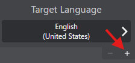

# Multiple Target Languages

VRCT allows you to translate your messages to up to 3 different target languages simultaneously. This is perfect for multilingual group conversations.

## Overview

When you need to communicate with people speaking different languages in the same VRChat world, the multiple target languages feature lets you send translations in several languages at once.

## How to Use

### Adding Target Languages

1. In the main window, locate the language settings section
2. Click the **[+]** button next to the target language  
  
3. Select the additional language from the menu  
  
4. Repeat to add up to 3 target languages total

### Removing Target Languages

1. Click the **[-]** button next to the target language you want to remove

2. The language will be removed immediately

## Message Display

When multiple target languages are set:

1. Your original message is shown first
2. Translations appear in the order of the target languages you set

**Example**:  
**Japanese** to (**English**, **Korean**, **Spanish**) set as target languages  

:::tip[Tip]
The order of translations matches the order of your target language settings from top to bottom.
:::

## Use Cases

### Multilingual VRChat Worlds

When visiting international worlds with players from different countries:
- Set all common languages used in that world
- Everyone can see translations in their preferred language

### Event Hosting

When hosting events with international attendees:
- Add all major languages of your expected audience
- Ensure important announcements reach everyone

### Language Learning

When practicing multiple languages:
- See how your message translates to different languages
- Compare translations across different target languages

## Performance Considerations

### Translation Speed

- More target languages = more API calls or processing
- Cloud-based engines: Multiple API requests
- AI engines: Sequential processing

:::info[Info]
Using 3 target languages will take approximately 3x longer than using 1 target language.
:::

### API Limits

If using cloud-based translation engines:
- Each target language counts as a separate API call
- Monitor your API usage if you have quota limits
- Consider mixing free AI engines with paid APIs

## Best Practices

1. **Start with Essential Languages**: Add only languages you actually need
2. **Monitor Performance**: If translations are too slow, reduce target languages
3. **Choose Appropriate Engines**: Use the best engine for each language pair
4. **Update as Needed**: Add/remove languages based on who's in the world

## Limitations

- Maximum 3 target languages can be set at once
- Each language must be different from your source language

## Troubleshooting

### Translations Taking Too Long

- Reduce the number of target languages
- Switch to faster translation engines (Google, Bing)
- Check network connection (for cloud engines)

### Target Language Not Appearing
- Verify the translation engine supports that language pair

### Messages Too Long for VRChat Chatbox

- VRChat chatbox has a character limit (144 characters)
- Multiple translations may exceed this limit
- If the character limit is exceeded, messages may not display correctly. Please reduce the number of target languages or shorten the message if necessary.

## Related Features

- [Translation Engines](./translation-engines) - Learn about available engines
- [Real-time Translation](./translation) - Basic translation feature
- [Language Presets](./language-presets) - Save common language combinations
