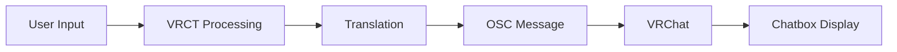

# OSC Integration

VRCT uses Open Sound Control (OSC) to communicate with VRChat, enabling features like sending messages to the in-game chatbox.

## Overview

OSC (Open Sound Control) is a protocol for networking sound synthesizers, computers, and other multimedia devices. VRChat uses OSC to allow external applications like VRCT to interact with the game.

## What OSC Enables

Through OSC integration, VRCT can:
- Send translated messages to VRChat chatbox
- Display text above your avatar
- Interact with VRChat parameters
- Enable real-time communication features

## VRChat OSC Setup

### Enable OSC in VRChat

1. Launch VRChat
2. Open the Action Menu (R key on keyboard, or hold B on Quest controllers)
3. Navigate to **Options** → **OSC**
4. Enable **OSC**
5. Enable **Chatbox** (for message display)

<!--  -->

:::info[Info]
OSC settings persist between VRChat sessions, so you only need to enable it once.
:::

### Reset OSC Configuration

If you experience issues:
1. In VRChat Action Menu, go to **Options** → **OSC**
2. Click **Reset Config**
3. Restart VRChat
4. Re-enable OSC and Chatbox

## VRCT OSC Configuration

VRCT is pre-configured to work with VRChat's default OSC settings.

### Default Settings

- **OSC IP Address**: 127.0.0.1 (localhost)
- **OSC Port**: 9000 (VRChat default receive port)
- **OSC Protocol**: UDP

### Custom Configuration

If you need to change OSC settings:

1. Open VRCT Settings window
2. Navigate to the **OSC** or **Advanced** section
3. Configure OSC parameters
4. Save and restart VRCT

For detailed OSC configuration, see the [Advanced Settings Guide](/config-advanced).

## How It Works

### Sending Messages to Chatbox

1. You type or speak a message in VRCT
2. VRCT translates the message (if translation is enabled)
3. VRCT sends the message via OSC to VRChat
4. VRChat displays the message in the chatbox above your avatar

```
VRCT → OSC (Port 9000) → VRChat → Chatbox Display
```

### Message Flow



## Chatbox Features

### Character Limit

VRChat chatbox has a **144-character limit** per message.

VRCT handles this by:
- Truncating long messages
- Splitting into multiple messages (if configured)
- Prioritizing translated text

### Message Display

Messages sent via OSC:
- Appear above your avatar
- Visible to nearby players
- Automatically disappear after a few seconds
- Can be toggled on/off in VRChat

## Troubleshooting

### Messages Not Appearing in VRChat

1. **Check VRChat OSC is Enabled**
   - Open Action Menu → Options → OSC
   - Ensure OSC and Chatbox are enabled

2. **Verify VRCT is Running**
   - VRCT must be running before or while VRChat is running
   - Check VRCT is not showing any error messages

3. **Check Firewall Settings**
   - Ensure Windows Firewall allows VRCT and VRChat to communicate
   - Allow UDP traffic on port 9000

4. **Restart Both Applications**
   - Close VRChat and VRCT
   - Start VRCT first
   - Then start VRChat
   - Re-enable OSC in VRChat

5. **Reset OSC Configuration**
   - In VRChat, reset OSC config
   - Restart both applications

### OSC Connection Issues

**Check Port Conflicts**
- Ensure no other application is using port 9000
- Try changing the port in both VRChat and VRCT

**Verify Network Settings**
- Check if antivirus/security software is blocking OSC
- Temporarily disable firewall for testing

**Test OSC Connection**
- Use OSC debugging tools to verify connectivity
- Check VRCT logs for OSC errors

### Delayed Messages

- **Network latency**: Usually OSC is very fast on localhost
- **System resources**: Check CPU/GPU usage
- **VRChat performance**: Ensure VRChat is running smoothly

## Advanced Usage

### Custom OSC Parameters

VRCT can send custom OSC parameters to VRChat avatars if configured:
- Avatar parameters
- Custom expressions
- Gesture controls
- Other avatar features

See the [Advanced OSC Guide](/config-advanced) for more information.

### Multiple VRCT Instances

Generally, only one VRCT instance should send OSC to VRChat:
- Multiple instances may conflict
- Can cause message duplication or loss

### OSC Debugging

Enable OSC debugging in VRCT settings to:
- See OSC messages being sent
- Diagnose connection issues
- Monitor OSC traffic

## Security Considerations

### Local Network Only

By default, OSC uses localhost (127.0.0.1):
- Only your computer can communicate
- Safe from external network access

### Remote OSC (Advanced)

If using remote OSC:
- Be aware of network security risks
- Use firewall rules to restrict access
- Only use on trusted networks

## Performance

OSC communication is very lightweight:
- Minimal CPU usage
- Low network bandwidth
- No impact on VRChat performance

## Related Features

- [Send Message](./send-message) - Learn how to send messages via OSC
- [VRC Mute Sync](./vrc-mute-sync) - Synchronize mute status via OSC
- [Advanced Settings](/config-advanced) - Configure OSC parameters
