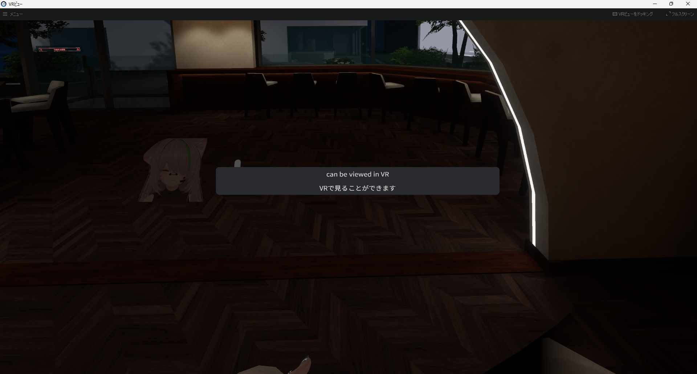
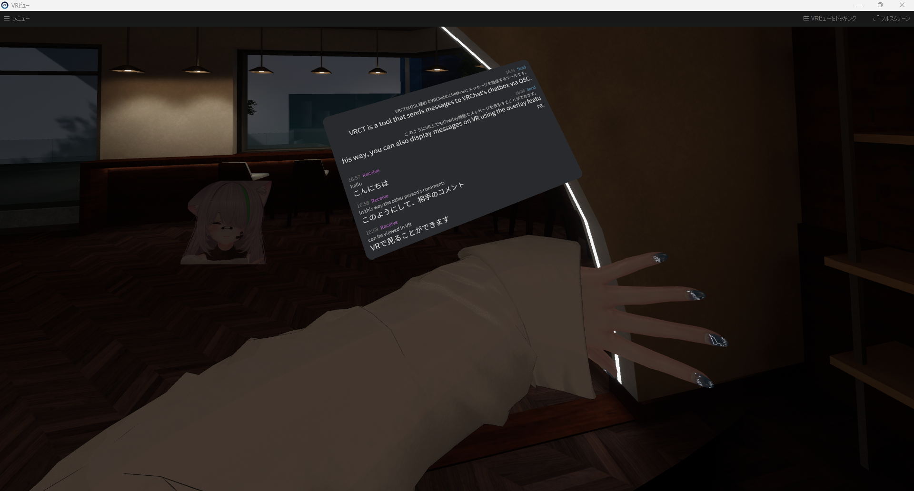

# Overlay Mode (VR)

Overlay Mode allows you to display the VRCT interface directly in VR as an overlay, making it easy to view translations and chat history while playing VRChat in VR.

## Overview

When using VRChat in VR, you can:
- View VRCT interface inside your VR headset
- Position and resize the overlay window
- Read translations without leaving VR

### Single line Mode and Multiple lines Mode
- **Single line Mode**: Displays one line of text at a time for quick glances (only show received messages)  

- **Multiple lines Mode**: Displays several lines of text for more context  

## How to Enable

### Enable Overlay

1. In the Overlay settings window, **Single line** or **Multiple lines** click the **Enable** toggle
2. Click **Send Sample Texts To Overlay** button to test the overlay in VR
3. Adjust position and settings as needed

refer to the docs on [VR Settings Guide](/docs/config-vr) or [VR Overlay Settings in Main Window](/docs/main-window#overlayvr-button) for more details on accessing overlay settings.

## Overlay Configuration

### Position and Size

**Position**:
- x, y, z coordinates to set overlay location in VR space

**Rotation**:
- Adjust pitch, yaw, roll to orient overlay

### Tracking

**Head-Locked (HMD)**:
- Overlay follows your head movement
- Always visible in your field of view
- Good for constant monitoring

**Wrist-Locked (Left Hand or Right Hand)**:
- Overlay attached to your wrist
- Visible when you raise your hand
- Convenient for quick glances

### Opacity

- Adjust transparency of the overlay
- Higher opacity: Easier to read, more obstructive
- Lower opacity: Less obstructive, harder to read
- Find the balance that works for you

## UI Scaling
- Adjust size of overlay elements for readability

## Display Duration
- Set how long overlay remains visible after interaction

## Fadeout Duration
- Set time for overlay to fade out when not in use
- If set to 0, overlay stays visible unless you change it to a non-zero number

## Using Overlay in VR

### Reading Translations

1. Enable Speaker2Log to transcribe others' voices
2. View transcribed and translated text in the overlay
3. Read while continuing to interact in VRChat

### Sending Messages

1. Enable Voice2Chatbox
2. Speak into your microphone
3. Message automatically sent to chatbox

## VR Headset Compatibility

### Tested Headsets

- Meta Quest 2
- Meta Quest 3
- Pico 4

:::info[Info]
Overlay feature requires SteamVR or compatible VR runtime.
:::

## Performance Considerations

### System Resources

Overlay mode requires additional resources:
- GPU rendering for VR overlay
- SteamVR overlay system
- May impact VRChat performance slightly

## Best Practices

### Positioning

1. **Test Different Positions**: Find what works best for your play style
2. **Avoid Center View**: Don't block important game elements
3. **Easy to Glance**: Position where you can quickly check translations

### Readability

1. **Sufficient Size**: Make text large enough to read comfortably
2. **Proper Distance**: Not too close (hard to focus) or too far (hard to read)

### Workflow

1. **Enable When Needed**: Turn on overlay for conversations
2. **Disable When Not**: Turn off during activities or events

## Troubleshooting

### Overlay Not Appearing

- Ensure SteamVR is running
- Check if VR headset is properly connected
- Restart VRCT and SteamVR
- Verify overlay is enabled in settings

### Overlay Not Visible in VRChat

- Check overlay distance and position settings
- Ensure opacity is high enough
- Try resetting overlay position
- Check SteamVR overlay permissions

### Text Hard to Read

- Increase font size
- Adjust overlay distance (bring closer)

## Related Features

- [Main Window Overview](/main-window) - Learn about the main interface
- [Speaker to Text](./speaker-to-text) - Transcribe voices in VR
- [VR Settings](/config-vr) - Configure VR overlay options
- [Appearance Customization](./appearance) - Customize overlay appearance
