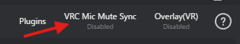

# VRC Mute Sync

VRC Mute Sync automatically synchronizes the microphone mute status between VRChat and VRCT, ensuring both applications stay in sync when you mute or unmute.

## Overview

When enabled, VRC Mute Sync:
- Detects when you mute/unmute in VRChat
- Automatically mutes/unmutes VRCT transcription
- Prevents sending transcribed text when muted in VRChat
- Keeps both applications in sync

This ensures you don't accidentally send transcribed messages when you think you're muted.

## How to Enable

### Open VRC Mute Sync Settings

1. In the VRCT main window, click the **VRC Mute Sync** button
2. The VRC Mute Sync Config Window will open
3. Toggle the sync feature on/off

### Enable Sync

#### Method 1: Main Window

1. In the main window, locate the **VRC Mute Sync** toggle switch  

2. VRCT will now monitor VRChat's mute status

#### Method 2: Config Window

1. In config window, locate the **VRC Mic Mute Sync** checkbox (Other Tab)  

2. VRCT will now monitor VRChat's mute status

## How It Works

### Detection

VRC Mute Sync monitors VRChat's mute status through:
- OSC parameters
- VRChat avatar parameters

When you mute or unmute in VRChat, VRCT detects the change almost instantly.

### Synchronization

When you mute in VRChat:
1. VRChat sends mute status via OSC
2. VRCT detects the status change
3. VRCT automatically disables Voice2Chatbox
4. No transcribed text is sent while muted

When you unmute in VRChat:
1. VRChat sends unmute status
2. VRCT detects the change
3. VRCT automatically re-enables Voice2Chatbox
4. Transcription resumes

## Use Cases

### Privacy Protection

Prevent accidentally sending transcribed text when you think you're muted:
- Muted for private conversations
- Muted during breaks
- Muted in inappropriate situations

## Troubleshooting

### Sync Not Working

**Check OSC Configuration**:
- Ensure VRChat OSC is enabled
- Verify OSC port settings match
- Reset OSC config in VRChat

**Verify VRCT Settings**:
- VRC Mute Sync is enabled
- Correct sync mode selected

**Restart Applications**:
1. Close both VRChat and VRCT
2. Start VRCT first
3. Then start VRChat
4. Enable OSC in VRChat

### Delayed Sync

- Adjust sync delay settings
- Check system performance (CPU usage)
- Verify network/OSC latency is minimal
- Reduce other application load

### False Triggers

If mute sync triggers incorrectly:
- Increase sync delay
- Check for OSC parameter conflicts
- Verify avatar mute parameter is standard

### One-Way Sync Only

If bidirectional sync doesn't work:
- Ensure both applications support two-way OSC
- Check OSC parameter permissions
- May require custom avatar setup

## Limitations

### OSC Dependency

- Requires VRChat OSC to be enabled
- Network/firewall issues can affect sync
- Local OSC communication only

### Detection Accuracy

- Sync may not be instant (slight delay)
- False positives/negatives possible
- Depends on OSC message reliability

## Privacy & Security

### Local Communication

- Sync uses local OSC only (127.0.0.1)
- No external network communication
- Safe and secure

## Related Features

- [Voice to Text](./voice-to-text) - Microphone transcription
- [OSC Integration](./osc-integration) - Learn about OSC
- [Other Settings](../config-other) - Additional sync options
- [Advanced Settings](../config-advanced) - Custom OSC parameters