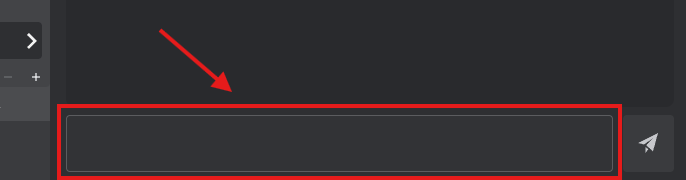
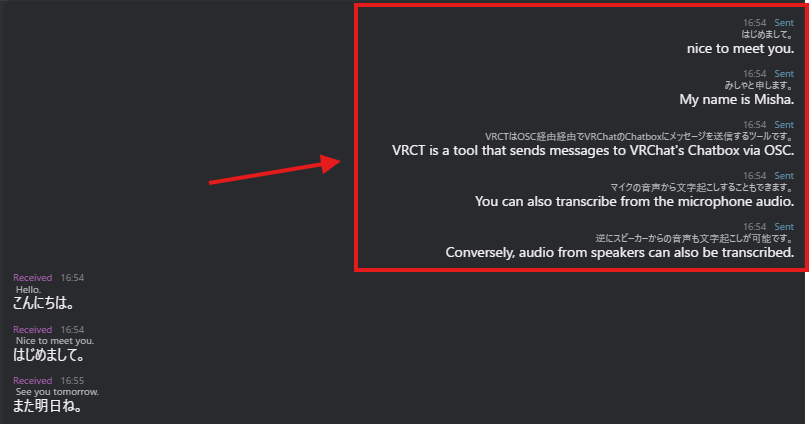

# Send Message

Learn how to send messages with translation using VRCT.  
Messages can be sent via text input or voice input, and will be translated and sent to VRChat chatbox.

## Overview

VRCT offers multiple ways to send messages:
1. **Text Input**: Type messages directly
2. **Voice Input**: Speak into your microphone
3. Both methods support real-time translation

## Text Input Method

### Basic Text Sending

1. Locate the input field at the bottom of the main window
2. Click inside the input field  

3. Type your message
4. Press **Enter key** or click the **Send Message** button  

### Keyboard Shortcuts

- **Enter**: Send the message
- **Shift + Enter**: Insert a line break (multi-line message)
- **Shift + Up Arrow**: Recall the last sent message for editing
- **Shift + Down Arrow**: Navigate forward in message history (if available)

:::tip[Tip]
You can edit previously sent messages by pressing Shift + Up Arrow, making changes, and sending again.
:::

### With Translation

1. Enable the **Translation** toggle
2. Set your **Your Language** (the language you're typing in)
3. Set **Target Language** (the language to translate to)
4. Type your message in your language
5. Press Enter to send
6. Your message will be translated and sent to VRChat

**What You'll See**:
- Original message (right side of chat history)
- Translated message (also displayed)
- Both original and translation sent to VRChat chatbox

## Voice Input Method

### Enable Voice2Chatbox

1. Click the **Voice2Chatbox** toggle to enable it
2. Ensure your microphone is selected in settings
3. Speak into your microphone
4. Your speech will be transcribed to text
5. The message is automatically processed and sent

:::warning[Important]
Before using voice input, configure your microphone in [Device Settings](/docs/config-device).
:::

### Voice Input with Translation

1. Enable **Translation** toggle
2. Enable **Voice2Chatbox** toggle
3. Set **Your Language** to your speaking language
4. Set **Target Language** to desired translation language
5. Speak into your microphone
6. Your speech → transcribed → translated → sent to VRChat

### Voice Input Tips

1. **Speak Clearly**: Articulate words for better transcription
2. **Moderate Pace**: Not too fast, not too slow
3. **Reduce Noise**: Minimize background sounds
4. **Pause Between Sentences**: Helps with punctuation and processing

For more details, see the [Voice to Text Guide](./voice-to-text).

## Translation Options

### Multiple Target Languages

Send translations in multiple languages simultaneously:

1. Click the **[+]** button next to Target Language
2. Select additional languages (up to 3 total)
3. Type or speak your message
4. All translations will be sent together

For more details, see the [Multiple Target Languages Guide](./multi-target-language).

### Select Translation Engine

Choose the best translation engine for your needs:

1. Click on the translation engine name below the target language
2. Select from available engines (Google, DeepL, AI Translation, etc.)
3. Your messages will use the selected engine

For more details, see the [Translation Engines Guide](./translation-engines).

## Message Display

### Chat History

After sending, messages appear in the chat history:
- **Right side**: Your sent messages
- Original text shown
- Translated text shown below
- Timestamp (if enabled)

### VRChat Chatbox

Your translated message appears:
- In VRChat chatbox above your avatar
- Visible to nearby players
- Automatically disappears after a few seconds

## Message Formatting

### Multi-line Messages

Create multi-line messages:
1. Type first line
2. Press **Shift + Enter** to add line break
3. Type next line
4. Repeat as needed
5. Press **Enter** to send

:::info[Note]
VRChat chatbox has limited character display. Very long messages may be truncated.
:::

## VRChat Integration

### OSC Connection

Messages are sent to VRChat via OSC (Open Sound Control):

1. Ensure VRChat OSC is enabled
2. VRCT automatically connects
3. Messages sent to chatbox in real-time

For OSC setup, see the [OSC Integration Guide](./osc-integration).

### Character Limit

VRChat chatbox has a **144-character limit**:
- VRCT automatically handles truncation
- Long messages may be cut off
- Prioritizes original text (You can also display only the translated text)

## Best Practices

### For Better Translations

1. **Use Simple Sentences**: Easier to translate accurately
2. **Avoid Slang**: May not translate well
3. **Choose Appropriate Engine**: Different engines for different quality

### For VRChat Communication

1. **Keep Messages Concise**: Respect character limit
2. **Send One Thought at a Time**: Easier to read
3. **Use Appropriate Language**: Match the world's community
4. **Be Patient**: Allow time for translation and sending

### For Voice Input

1. **Speak Naturally**: Natural speech works best
2. **Pause Between Messages**: Allows processing time
3. **Adjust Microphone**: Proper distance and volume

## Troubleshooting

### Message Not Sending

- Check if Translation toggle is on (if using translation)
- Verify VRChat OSC is enabled
- Ensure VRCT is connected to VRChat
- Check for error messages in VRCT

### Translation Not Working

- Verify translation engine is selected
- Check internet connection (for cloud engines)
- Ensure languages are correctly set
- Try a different translation engine

### Voice Input Not Working

- Check microphone is selected in settings
- Verify Voice2Chatbox toggle is enabled
- Test microphone in Windows settings
- Check microphone permissions

### Message Not Appearing in VRChat

- Ensure VRChat chatbox is enabled
- Check OSC settings
- Restart both VRChat and VRCT
- Verify OSC port is correct (default 9000)

For more troubleshooting, see the [FAQ](/docs/faq).

## Related Features

- [Receive Message](./receive-message) - Learn about receiving messages
- [Voice to Text](./voice-to-text) - Detailed voice input guide
- [Real-time Translation](./translation) - Translation feature overview
- [OSC Integration](./osc-integration) - VRChat connection setup
- [Multiple Target Languages](./multi-target-language) - Send in multiple languages
