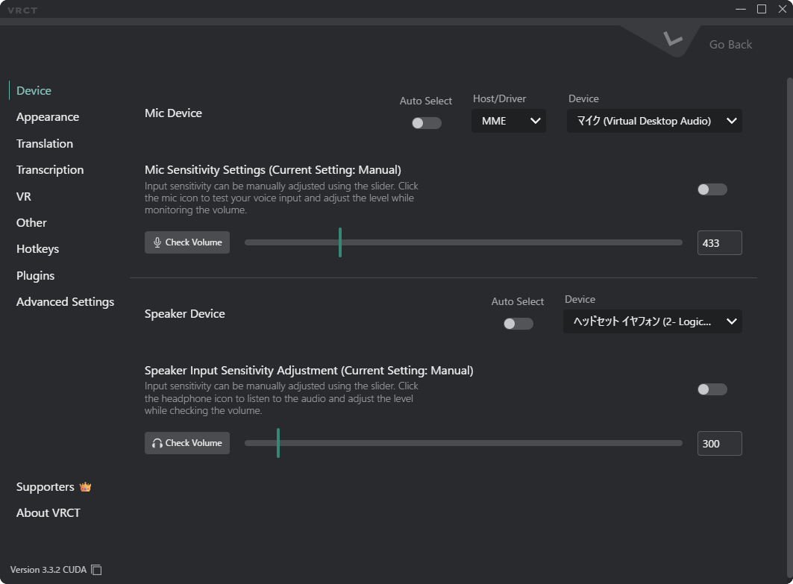

# Configuration Window Overview

The Configuration Window allows you to customize various aspects of VRCT, from appearance to translation engines.   
Click the **gear icon (⚙️)** on the main window to open it.

## 1. Device
Manage your audio input and output devices.  
refer to the [Device Tab](./config-device) page for more details.

## 2. Appearance
Customize the look and feel of the application.  
refer to the [Appearance Tab](./config-appearance) page for more details.
## 3. Translation
Configure the translation engines.  
refer to the [Translation Tab](./config-translation) page for more details.

## 4. Transcription
Configure the transcription engines.  
refer to the [Transcription Tab](./config-transcription) page for more details.
## 5. VR
Configure VR-related(mainly about Overlay) settings.  
refer to the [VR Tab](./config-vr) page for more details.

## 6. Other
Configure other miscellaneous settings.  
refer to the [Other Tab](./config-other) page for more details.
## 7. HotKeys
Configure keyboard shortcuts for various actions in VRCT.  
refer to the [HotKeys Tab](./config-hotkeys) page for more details.

## 8. Plugins
Configuration options for managing VRCT plugins.  
refer to the [Plugins Tab](./config-plugins) page for more details.
## 9. Advanced Settings
Advanced configuration options for VRCT.  
refer to the [Advanced Settings Tab](./config-advanced) page for more details.