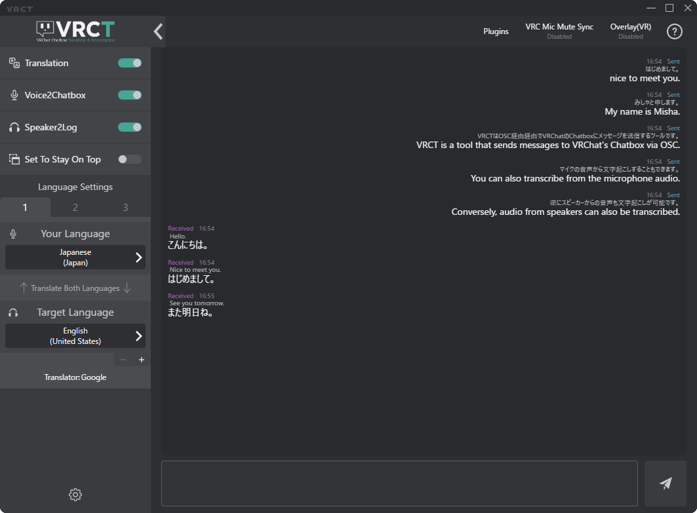
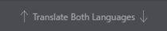
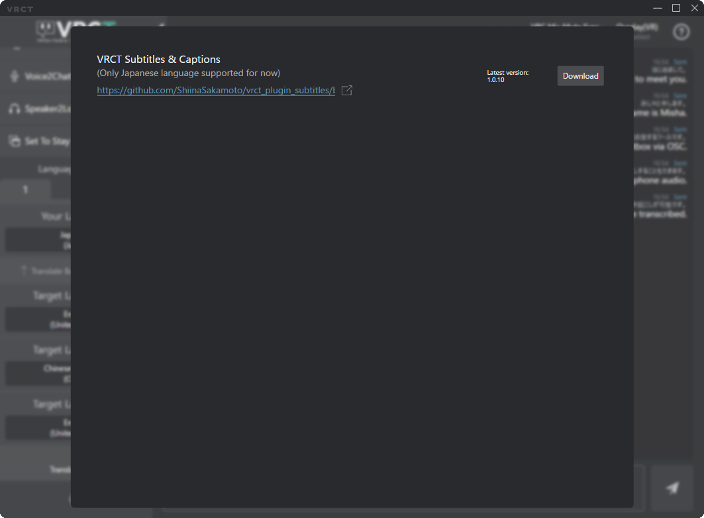

# Main Window Overview

Here is an overview of the VRCT main window and its features.

## Translation Toggle Switch
  
When enabled, messages will be translated.

## Transcription Controls
  
Controls the microphone and speaker transcription.
- **Voice2Chatbox** Toggle Switch: Toggles microphone transcription (Voice to Text).
- **Speaker2Log** Toggle Switch: Toggles speaker transcription (System Audio to Text).

## Set To Stay On Top Toggle Switch
  
Keeps the VRCT main window on top of other windows when enabled.

## Language Settings
  
Displays the currently selected languages.
- **Your Language**: The language you are speaking or writing.
- **Target Language**: The language you want to translate to.

### Preset Tab
  
You can set up to three language presets.  
**Preset 1, 2, 3**: Click to switch between presets.

### Your Language / Target Language
  
Click on a language area in **Your Language** / **Target Language** to display the language selection menu.  
Please select the language you need for communication.  

### Swap Languages
  
Clicking this area allows you to quickly swap or change languages.

### Additional Target Language
  
You can add an additional target language for translation.
- Click the **[+]** button to add another target language.  
- Up to 3 target languages can be added.  

- Click the **[-]** button to remove the additional target language.

:::tip[tip]
When multiple target languages are set, the translated messages will be displayed in the order of the target languages set.
:::

### Translation Engine Selection
  
You can select translation engines.
- Click the translation engine name area to display the selection menu.  

- Select the translation engine you want to use for that target language.
    - Google, DeepL, Bing, Papago, etc.
    - API-based engines
    - AI-based engines
    - others (continuously adding...)
- default engines are AI Translation(m2m100 model).
    - Reference : https://huggingface.co/docs/transformers/model_doc/m2m_100
    - You can select different AI models in the Config Window. refer to the [Translation Guide](./config-translation).

## Chat History
Displays the conversation history.
- **Left side**: Messages received from others.
- **Right side**: Messages sent by you.
Each message shows the original text and the translated text.

## Input Field
  
Type your message here to send it via chat.
- Click the Right side Button to send the message.
- You can use the following keyboard shortcuts:
    - Press **Enter** to send.
    - Press **Shift + Enter** to insert a line break.
    - Press **Shift + Up Arrow** to recall the last sent message for editing.

## Configuration Button
  
Opens the Config Window where you can configure VRCT options.
For details, refer to the [Config Window Guide](./config-window).

## Plugins Button
  
Opens the Plugins Config Window where you can manage VRCT plugins.
  

## VRC Mute Sync Button
  
Opens the VRC Mute Sync Config Window.  
  
When enabled, VRCT will synchronize the mute status between VRChat and VRCT.  
For details, refer to the [VRC Mute Sync Guide](./config-other#general).

## Overlay(VR) Button
  
Opens the Overlay(VR) Config Window.
  
For details, refer to the [Overlay(VR) Guide](./config-vr).

## Help Button
  
Opens the help menu with links to documentation.

## Message Log Font Size Slider
  
Opens the font size slider window.

- Slider: Adjust the Message Log font size.
- Default size is 100.