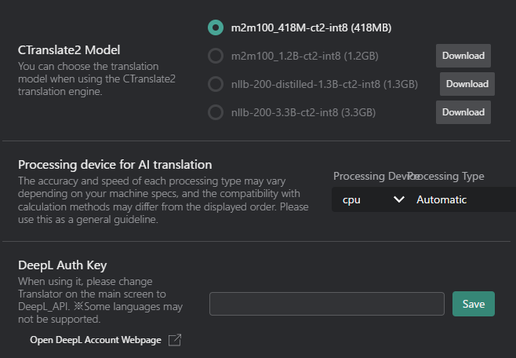

# Translation Tab
Customize your translation engine settings.

## CTranslate2 Model and Settings
- **CTranslate2 Model**: Select the local model for offline transcription/translation (if available).
    | Model Name | Size | Description |
    |------------|-------------|-------------|
    | m2m100_41M-ct2-int8 | 418MB | Facebook's Multilingual Machine Translation model supporting 100 languages. |
    | m2m100_1.2B-ct2-int8 | 1.2GB | Larger version of Facebook's M2M100 model with improved translation quality. |
    | nllb-200-distilled-1.3B-ct2-int8 | 1.3GB | Meta's NLLB-200 distilled model supporting 200 languages with high accuracy. |
    | nllb-200-3.3B-ct2-int8 | 3.3GB | Full version of Meta's NLLB-200 model for best translation quality. |
    - **Download Button**: If you haven't downloaded the model yet, click this button to download it.

- **Processing device for AI translation**: Select the processing device for translation tasks.
    - **Processing Device**:
        - **CPU**: Uses the computer's main processor for translation tasks.
        - **GPU**: Utilizes the graphics card for potentially faster processing (if supported).
        :::tip[tip]
        If you want to use the GPU with the CTranslate2 Model, you need to change VRCT to the CUDA version.  
        refer to the [Reinstall VRCT with CUDA version](./config-advanced) page for more details.
        :::
    - **Processing Type**:
        | Type | Accuracy | Speed | Description |
        |------|----------|-------|-------------|
        | Automatic | Auto | Auto | Automatically selects the best processing type based on your hardware capabilities. |
        | int8 | Low | Fast | Uses 8-bit integer precision for faster processing with lower memory usage. |
        | int8_float16 | Medium | Fast | Uses a combination of 8-bit integer and 16-bit floating-point precision for a balance between speed and accuracy. |
        | int8_bfloat16 | Medium | Fast | Uses a combination of 8-bit integer and bfloat16 precision for efficient processing on compatible hardware. |
        | int8_float32 | High | Medium | Uses a combination of 8-bit integer and 32-bit floating-point precision for higher accuracy. |
        | int16 | Low | Medium | Uses 16-bit integer precision for lower memory usage. |
        | bfloat16 | Medium | Medium | Uses bfloat16 precision for efficient processing on compatible hardware. |
        | float16 | Medium | Medium | Uses 16-bit floating-point precision for a balance between speed and accuracy. |
        | float32 | High | Slow | Uses 32-bit floating-point precision for the highest accuracy. |

        :::tip[tip]
        The optimal Processing Type varies depending on your hardware environment.   
        Please try several options to find what works best for you.
        :::

        Reference: https://opennmt.net/CTranslate2/quantization.html

## APIs
Enter your API keys for services like DeepL or OpenAI if you are using their paid/pro features.

### DeepL API
- **DeepL API Key**: Enter your API key for using DeepL translation services.

### Plamo API
- **Plamo API Key**: Enter your API key for using Plamo translation services.
- **Select Plamo Model**: Choose the specific Plamo model for translation.
    - Various models are available for different languages and purposes.
    - Refer to the Plamo documentation for details on each model.

### Gemini API
- **Gemini API Key**: Enter your API key for using Gemini translation services.
- **Select Gemini Model**: Choose the specific Gemini model for translation.
    - Various models are available for different languages and purposes.
    - Refer to the Gemini documentation for details on each model.

### OpenAI API
- **OpenAI API Key**: Enter your API key for using OpenAI translation services.
- **Select OpenAI Model**: Choose the specific OpenAI model for translation.
    - Various models are available for different languages and purposes.
    - Refer to the OpenAI documentation for details on each model.

### LM Studio API
- **Check LM Studio Connection**: Test the connection to the LM Studio server for local AI translation.
    - Ensure that the LM Studio server is running and accessible.
- **LM Studio URL**: Specify the URL of your LM Studio server for local AI translation.
    - Default: `http://127.0.0.1:1234/v1`
- **Select LM Studio Model**: Choose the specific LM Studio model for translation.
    - Various models are available for different languages and purposes.
    - Refer to the LM Studio documentation for details on each model.

### Ollama API
- **Check Ollama Connection**: Test the connection to the Ollama server for local AI translation.
    - Ensure that the Ollama server is running and accessible.
- **Select Ollama Model**: Specify the Ollama model for translation.
    - Various models are available for different languages and purposes.
    - Refer to the Ollama documentation for details on each model.