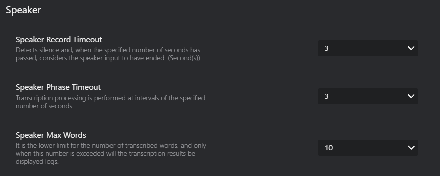
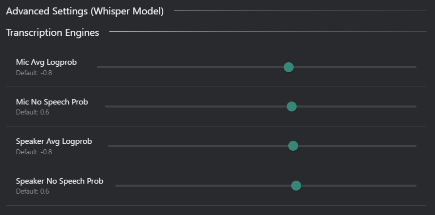

# Transcription Tab
Customize the transcription settings for microphone and speaker audio in the Transcription Tab of the Config Window

## Mic Transcription

- **Mic Record Timeout** : Set the timeout duration for microphone recording.
    - Detects silence and, when the specified number of seconds passes, the system considers the voice input to have ended. (Second(s))
- **Mic Phrase Timeout** : Set the timeout duration for microphone phrase detection.
    - Transcription processing is performed at intervals of the specified number of seconds.
- **Mic Max Words**: Set the maximum number of words for microphone transcription.
    - It is the lower limit for the number of transcribed words, and only when this number is exceeded will the transcription results be displayed logs and send to VRChat.
- **Mic Word Filter**: Enable or disable word filtering for microphone transcription.
    - If a registered word is detected, the message will not be sent. To add multiple words at once, separate them with ',' (comma).\n*Duplicate words will not be registered.

## Speaker Transcription

- **Speaker Record Timeout** : Set the timeout duration for speaker recording.
    - Detects silence and, when the specified number of seconds has passed, considers the speaker input to have ended. (Second(s))
- **Speaker Phrase Timeout** : Set the timeout duration for speaker phrase detection.
    - Transcription processing is performed at intervals of the specified number of seconds.
- **Speaker Max Words**: Set the maximum number of words for speaker transcription.
    - It is the lower limit for the number of transcribed words, and only when this number is exceeded will the transcription results be displayed logs.

## Transcription Engines

- **Transcription Engine Used For Speech Recognition**: Select the engine used for speech-to-text (e.g., Google, Whisper).
- **Whisper Model**: Choose the Whisper model for transcription (if Whisper is selected).
    | Model Name | Size | Description |
    |------------|------|-------------|
    | tiny       | 74.5 MB| Fastest, lowest accuracy |
    | base       | 141 MB | Fast, low accuracy |
    | small      | 463 MB | Balanced speed and accuracy |
    | medium     | 1.42 GB | Slower, higher accuracy |
    | large-v1   | 2.87 GB | Slowest, highest accuracy |
    | large-v2   | 2.87 GB | Slowest, highest accuracy |
    | large-v3   | 2.87 GB | Slowest, highest accuracy |
    | large-v3-turbo-int8 | 794MB | Slower, higher accuracy, optimized for performance |
    | large-v3-turbo      | 1.58GB | Slowest, highest accuracy, optimized for performance |
    - **Download Button**: If you haven't downloaded the selected Whisper model yet, click this button to download it.

- **Processing Device Used For AI transcription**: Select the processing device for transcription tasks.
    - **Processing Device**:
        - **CPU**: Use the computer's CPU for transcription processing.
        - **GPU**: Use the computer's GPU for transcription processing (if available).
        :::tip[tip]
        If you want to use the GPU with the CTranslate2 Model, you need to change VRCT to the CUDA version.  
        Refer to the [Reinstall VRCT with CUDA version](./config-advanced) page for more details.
        :::
    - **Processing Type**:
        | Type | Accuracy | Speed | Description |
        |------|----------|-------|-------------|
        | Automatic | Auto | Auto | Automatically selects the best processing type based on your hardware capabilities. |
        | int8 | Low | Fast | Uses 8-bit integer precision for faster processing with lower memory usage. |
        | int8_float16 | Medium | Fast | Uses a combination of 8-bit integer and 16-bit floating-point precision for a balance between speed and accuracy. |
        | int8_bfloat16 | Medium | Fast | Uses a combination of 8-bit integer and bfloat16 precision for efficient processing on compatible hardware. |
        | int8_float32 | High | Medium | Uses a combination of 8-bit integer and 32-bit floating-point precision for higher accuracy. |
        | int16 | Low | Medium | Uses 16-bit integer precision for lower memory usage. |
        | bfloat16 | Medium | Medium | Uses bfloat16 precision for efficient processing on compatible hardware. |
        | float16 | Medium | Medium | Uses 16-bit floating-point precision for a balance between speed and accuracy. |
        | float32 | High | Slow | Uses 32-bit floating-point precision for the highest accuracy. |

        :::tip[tip]
        The optimal Processing Type varies depending on your hardware environment.   
        Please try several options to find what works best for you.
        :::
        Reference: https://opennmt.net/CTranslate2/quantization.html

## Additional Settings(Whisper Model)

- **Mic Avg Logprob**: Set the average log probability threshold for microphone transcription.
- **Mic No Speech prob**: Set the no speech threshold for microphone transcription.
- **Speaker Avg Logprob**: Set the average log probability threshold for speaker transcription.
- **Speaker No Speech prob**: Set the no speech threshold for speaker transcription.

:::tip[tip]
Avg Logprob  
    The average log-probability of all generated tokens in a segment.
    Higher values (closer to 0) indicate higher confidence.
    Lower values (e.g., below –1.0) suggest low confidence or possible misrecognition.

No Speech Prob  
    The probability that the input audio contains no speech.
    Values close to 1.0 indicate silence or background noise.
    This parameter is typically used to filter out false detections during quiet periods.
:::