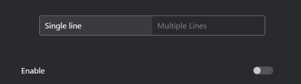
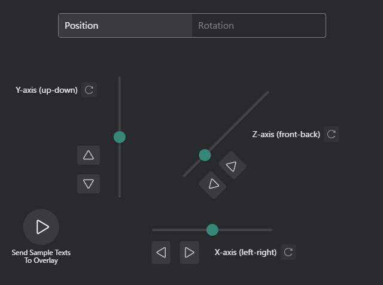
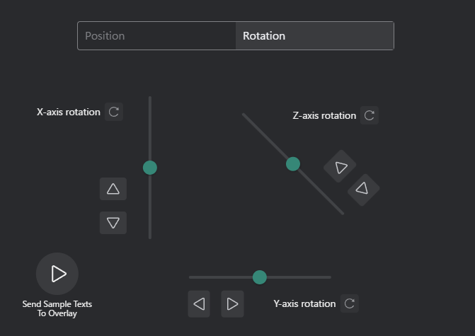
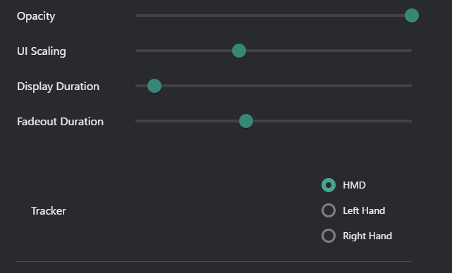

# VR Tab
Customize the VR settings in the VR Tab of the Configuration.

## Overlay Overview

  <iframe
    src="https://www.youtube.com/embed/uR6cHKFnjSQ"
    title="Overlay Video"
    style={{ position: 'absolute', top: 0, left: 0, width: '100%', height: '100%', border: 0 }}
    allow="accelerometer; autoplay; clipboard-write; encrypted-media; gyroscope; picture-in-picture; web-share"
    allowFullScreen
  />

### Enable Overlay

- **Single line / Multiple Line**: Choose between single-line or multi-line overlay display.
    - **Single line**: Displays one line of text at a time.
    - **Multiple Line**: Displays multiple lines of text simultaneously.

### Overlay Position and Rotate Controls
- **Position Controls**: Adjust the overlay position on the screen.
    - Use the arrow buttons to move the overlay up, down, left, or right.

- **Rotation Controls**: Rotate the overlay display.
    - Use the rotation buttons to rotate the overlay clockwise or counterclockwise.

### Overlay Window Settings

- **Opacity**: Adjust the transparency of the overlay.
    - Move the slider to set the desired opacity level (0% to 100%).
- **UI Scaling**: Adjust the size of the overlay UI elements.
    - Move the slider to increase or decrease the UI scaling percentage.
- **Display Duration** : Set how long the overlay remains visible.
    - Move the slider to set the display duration in seconds.
- **Fadeout Duration** : Set the duration for the overlay to fade out.
    - Move the slider to set the fadeout duration in seconds.
- **Tracker**: Overlay window tracking settings.
    - **HMD**: When selected, the overlay will follow the position of the Head-Mounted Display (HMD).
    - **Left Hand**: When selected, the overlay will follow the position of the left controller.
    - **Right Hand**: When selected, the overlay will follow the position of the right controller.

### Common Settings

- **Show Only Translated Messages**: When enabled, only translated messages will be displayed in the overlay.