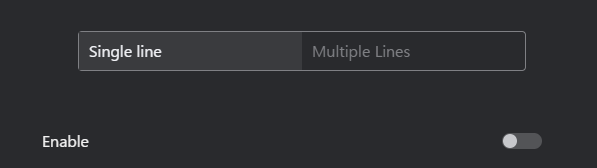
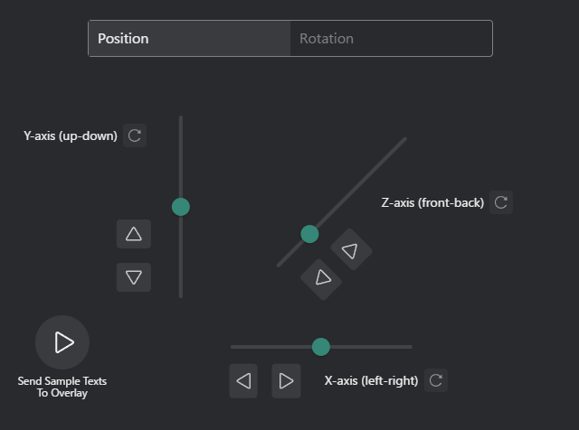
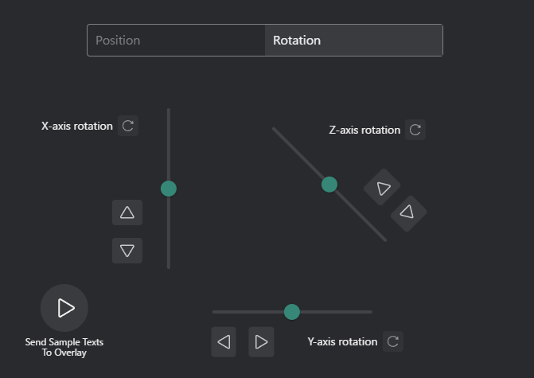
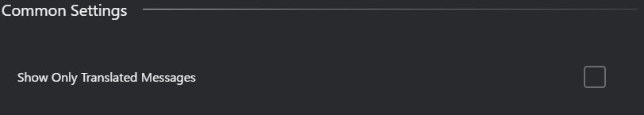

# VR Tab
Customize the VR settings in the VR Tab of the Config Window.

## Overlay Overview

  <iframe
    src="https://www.youtube.com/embed/uR6cHKFnjSQ"
    title="Overlay Video"
    style={{ position: 'absolute', top: 0, left: 0, width: '100%', height: '100%', border: 0 }}
    allow="accelerometer; autoplay; clipboard-write; encrypted-media; gyroscope; picture-in-picture; web-share"
    allowFullScreen
  />

### Enable Overlay

- **Single line / Multiple Line**: Choose between single-line or multi-line overlay display.
    - **Single line**: Displays one line of text at a time.
    - **Multiple Line**: Displays multiple lines of text simultaneously.

### Overlay Position and Rotate Controls
- **Position Controls**: Adjust the overlay position on the screen.
    - Use the arrow buttons to move the overlay up, down, left, or right.

- **Rotation Controls**: Rotate the overlay display.
    - Use the rotation buttons to rotate the overlay clockwise or counterclockwise.

### Overlay Window Settings

- **Opacity**: Adjust the transparency of the overlay.
    - Move the slider to set the desired opacity level (0% to 100%).
- **UI Scaling**: Adjust the size of the overlay UI elements.
    - Move the slider to increase or decrease the UI scaling percentage.
- **Display Duration** : Set how long the overlay remains visible.
    - Move the slider to set the display duration in seconds.
- **Fadeout Duration** : Set the duration for the overlay to fade out.
    - Move the slider to set the fadeout duration in seconds.
- **Tracker**: Overlay window tracking settings.
    - **HMD**: When selected, the overlay will follow the position of the Head-Mounted Display (HMD).
    - **Left Hand**: When selected, the overlay will follow the position of the left controller.
    - **Right Hand**: When selected, the overlay will follow the position of the right controller.

### Common Settings

- **Show Only Translated Messages**: When enabled, only translated messages will be displayed in the overlay.

## Voice Typing Mode

Voice Typing Mode enables hands-free text input into VR applications by automatically pasting transcribed voice into the active application.

### Enable Voice Typing Mode

- **Enable Voice Typing Mode** (checkbox)
- Voice transcription is automatically copied to clipboard and pasted into active VR applications

:::note[Note]
Voice Typing Mode only functions when running in VR. Desktop mode will not copy to clipboard or paste.
:::

### How Voice Typing Mode Works

1. You speak into your microphone (with Voice2Chatbox enabled)
2. Your speech is transcribed to text
3. The text is automatically copied to the system clipboard and pasted into the active VR application's focused text field

### Requirements

- Active VR session (SteamVR or compatible VR runtime)
- Voice2Chatbox enabled (microphone transcription active)
- Target VR application must support clipboard paste
- Microphone properly configured in [Device Config](/docs/config-device)

### Use Cases

Voice Typing Mode is useful for:
- **VRChat World Search**: Search for worlds by speaking world names
- **Japanese Input**: Input Japanese text without complex IME setup
- **VRChat Settings**: Text input in configuration menus
- **Multiplayer Games**: Chat without removing your headset
- **Any VR App**: Works with any application supporting clipboard paste

See the [Voice Typing Mode Guide](/docs/feature-guide/voice-typing-mode) for detailed usage instructions and troubleshooting.