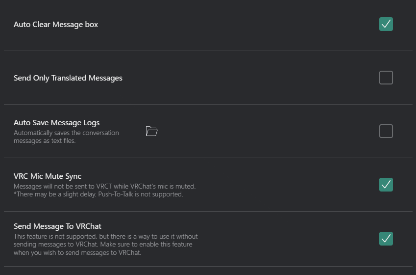
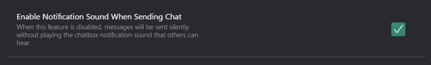
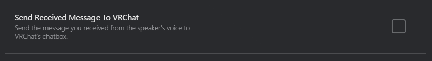

# Other Tab
Customize various miscellaneous settings in the Other tab of the VRCT configuration.

## General

- **Auto Clear Message Box**: Enable or disable automatic clearing of the message box after a send.
- **Send Only Translated Message**: Choose whether to send only the translated message or both original and translated messages.
- **Auto Save Message Log**: Enable or disable automatic saving of message logs.
    - : Open the directory where message logs are saved.
- **VRC Mic Mute Sync**: Enable or disable synchronization of mute status between VRChat and VRCT Mic Transcription.
- **Send Message To VRChat**: Enable or disable sending messages to VRChat.

## Sounds

- **Enable Notification Sound When Sending Chat**: Enable or disable notification sounds when sending chat messages in VRChat.

## Speaker2Chatbox

- **Send Receive Message To VRChat**: Enable or disable sending received messages to VRChat chatbox.

## Message Format
Define how messages are formatted when sent to VRChat.

### Send Message Format
Chat or Mic Transcription message format when sending to VRChat.

### Speaker2Chatbox Message Format
If you enable [Speaker2Chatbox](./config-other#speaker2chatbox), define how the received messages are formatted when sent to VRChat.

### Transliteration

- **Show Romaji**: Enable or disable the display of Romaji for Japanese text.
- **Show Hiragana**: Enable or disable the display of Hiragana for Japanese text.