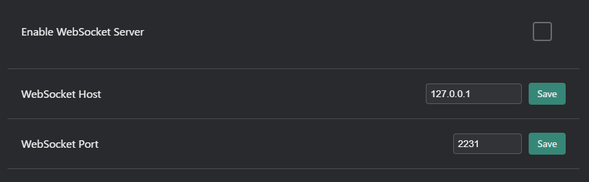

# Advanced Settings Tab
Configure advanced options in the Advanced Settings tab of the VRCT configuration.

## General

- **OSC IP Address**: Set the IP address for OSC communication.
- **OSC Port**: Specify the port number for sending OSC messages.
- **Open Config File**: Open the VRCT configuration file for manual editing.
- **Switch VRCT To CPU/GPU Version**: Choose between CPU or GPU processing for VRCT.

## WebSocket

- **Enable WebSocket Server**: Enable or disable WebSocket communication.
- **WebSocket Host**: Set the IP address for WebSocket communication.
- **WebSocket Port**: Specify the port number for WebSocket communication.