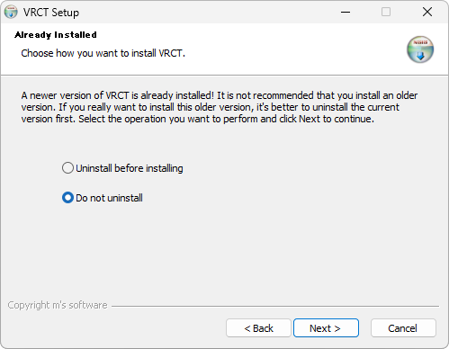

# インストール

setup.exeファイルをダウンロードして実行することで、VRCTをインストールできます。インストールを完了するには、以下の手順に従ってください。

## インストール手順
1. BoothまたはGitHubからsetup.exeファイルをダウンロードしてください。
    - [Booth](https://misyaguziya.booth.pm/items/5155325)
    - [GitHub Releases](https://github.com/misyaguziya/VRCT/releases/latest)

2. ダウンロードしたsetup.exeファイルをダブルクリックして実行してください。

:::tip[tip]
setup.exeファイルを実行すると、セキュリティ警告が表示される場合がありますが、これは正常です。警告が表示される場合は、「詳細情報」をクリックして、「とにかく実行」を選択してください。
:::

3. インストーラーが提供する指示に従ってインストールを進めてください。  
    **ステップ1**  
      
    **ステップ2**  
      
    **ステップ3**  
      
    :::tip[tip]
    UI言語は後で変更できます。
    :::

    **ステップ4**  
      
    **ステップ5**  
      
    既にアプリケーションをインストールしている場合は、既存のインストールを上書きするかどうかの確認が求められます。  
    **ステップ6**  
      
    **ステップ7**  
      
    **ステップ8**  
    

4. インストール完了後、「完了」ボタンをクリックしてインストーラーを閉じてください。  
