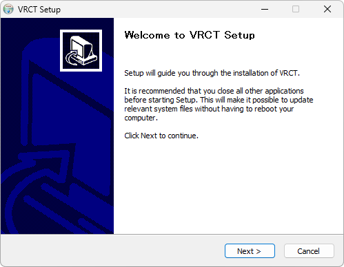
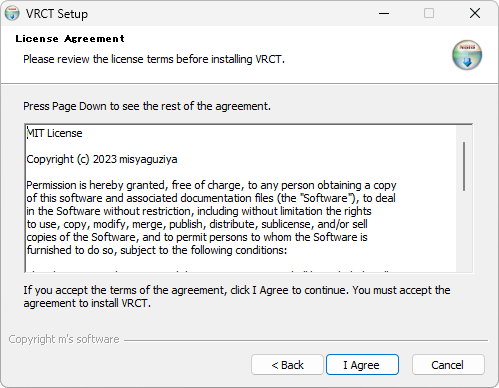
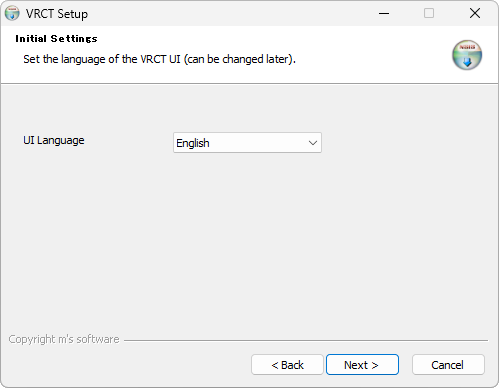
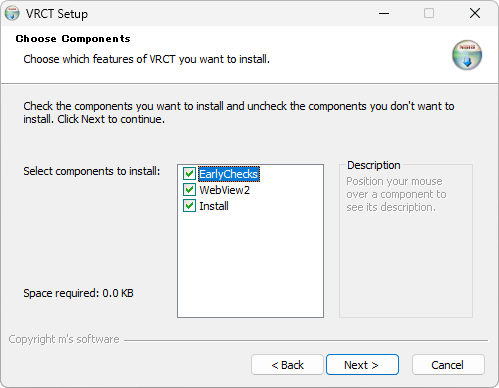
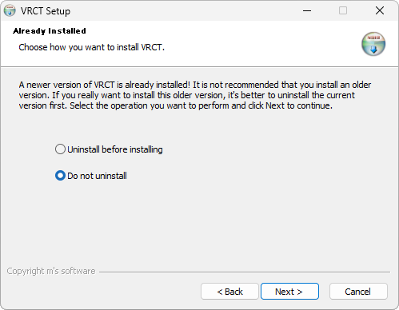
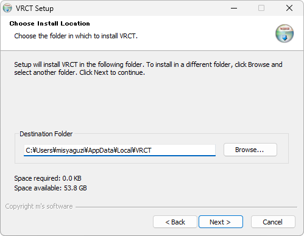
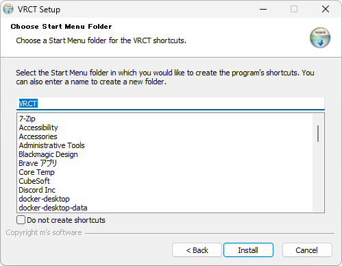
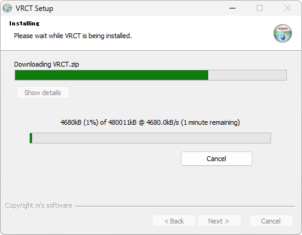

# インストール

setup.exeファイルをダウンロードして実行することで、VRCTをインストールできます。インストールを完了するには、以下の手順に従ってください。

## インストール手順
1. BoothまたはGitHubからsetup.exeファイルをダウンロードしてください。
    - [Booth](https://misyaguziya.booth.pm/items/5155325)
    - [GitHub Releases](https://github.com/misyaguziya/VRCT/releases/latest)

2. ダウンロードしたsetup.exeファイルをダブルクリックして実行してください。

:::tip[tip]
setup.exeファイルを実行すると、セキュリティ警告が表示される場合がありますが、これは正常です。警告が表示される場合は、「詳細情報」をクリックして、「とにかく実行」を選択してください。
:::

3. インストーラーが提供する指示に従ってインストールを進めてください。  
    **ステップ1**  
      
    **ステップ2**  
      
    **ステップ3**  
      
    :::tip[tip]
    UI言語は後で変更できます。
    :::

    :::info[v3.5.0〜: GPU版 / CPU版の選択]
    インストーラで **GPU版** と **CPU版** を選択できるようになりました。選択した版に必要なファイルのみがダウンロードされます。
    - **CPU版**：どの環境でも動作します。GPUを使わない場合はこちら。
    - **GPU版（CUDA）**：対応するNVIDIA GPUがある場合、文字起こし・翻訳を高速化できます。
    版はインストール後でも[詳細設定タブ](/docs/config-advanced)の「VRCTをCPU/GPUバージョンに切り替え」で変更できます。
    :::

    {/* TODO(v3.5.0): replace with ./img/installation_step_edition_select.png */}
    

    **ステップ4**  
      
    **ステップ5**  
      
    既にアプリケーションをインストールしている場合は、既存のインストールを上書きするかどうかの確認が求められます。  
    :::tip[v3.5.0〜]
    アップグレード時に設定ファイル（`config.json`）が引き継がれるようになりました。以前のように設定がすべて初期化されることはありません。
    :::
    **ステップ6**  
      
    **ステップ7**  
      
    **ステップ8**  
    

4. インストール完了後、「完了」ボタンをクリックしてインストーラーを閉じてください。  
