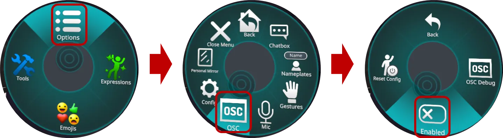
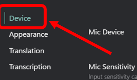
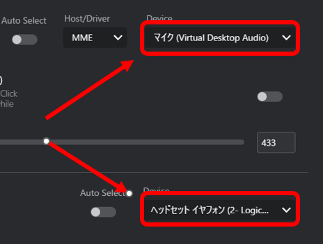

# 初期設定
このガイドでは、インストール後のVRCTの初期設定プロセスを説明します。

## ステップ1: VRCTを起動する
VRCTをインストール後、デスクトップまたはスタートメニューからVRCTアプリケーションアイコンを見つけて、ダブルクリックしてアプリケーションを起動してください。

## ステップ2: VRChat OSC設定を構成する
VRCTがVRChatと通信できるようにするには、VRChatでOSC（Open Sound Control）設定を構成する必要があります。以下の手順に従ってください：
1. VRChatを開き、エクスプレッションメニューに移動してください。
2. 「Option」→「OSC」→「Enable」に移動してください。  

3. スイッチを切り替えることで「OSC」オプションを有効にしてください。  

## ステップ3: 基本設定を構成する
VRCTを起動すると、デフォルト設定が自動的に適用されます。必要に応じて、以下の設定を確認および変更してください：

### 言語設定
    あなたが話す言語と翻訳したい言語を選択してください。
    1. **あなたの言語**: あなたが話す言語を選択してください。
    2. **対象言語**: 翻訳対象の言語を選択してください。

    
### マイクとスピーカーの設定
    VRCTが音声翻訳に使用するマイクとスピーカーデバイスを選択してください。  
    1. 「⚙️設定」ボタンをクリックして設定ウィンドウを開いてください。  
      
    2. デバイスタブを選択してください。  
      
    3. **マイクデバイス**: 入力に使用するマイクデバイスを選択してください。  
    4. **スピーカーデバイス**: 出力に使用するスピーカーデバイスを選択してください。  
      

### 翻訳エンジン設定
    会話中に翻訳したい言語を選択してください。  
    1. 文字起こしエンジンリストをクリックしてください。  
      
    2. 目的の文字起こしエンジンを選択してください。  
      
