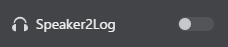

# スピーカーからテキスト（Speaker2Log）

スピーカーからテキスト機能（Speaker2Log）を使用すると、システム音声出力をテキストに文字起こしできます。これはVRChat音声チャットで他のプレイヤーが言っていることをキャプチャして翻訳するのに最適です。

## 概要

Speaker2Logは選択したスピーカー/オーディオ出力デバイスから音声をキャプチャし、以下を行います：
1. 音声をテキストに文字起こし
2. 文字起こしされたテキストを翻訳（翻訳が有効な場合）
3. 結果をチャット履歴に表示

これにより、音声チャットを通じて他のプレイヤーが言っていることを「読む」ことができます。

## 有効にする方法

### Speaker2Logを切り替え

1. メインウィンドウで**Speaker2Log**トグルスイッチを探す  
  
2. クリックしてスピーカー文字起こしを有効にする  
  
3. トグルはアクティブになるとオンになる

:::warning[重要]
この機能を有効にする前に、VRCT設定で正しいスピーカー/オーディオ出力デバイスが選択されていることを確認してください。
:::

## コンフィグレーション

### スピーカーデバイスを選択

1. コンフィグウィンドウを開く（ギアアイコンをクリック）
2. **デバイス**セクションに移動
3. スピーカードロップダウンリストからあなたのオーディオ出力デバイスを選択
4. 保存をクリック

:::tip[ヒント]
VRChatが使用しているものと同じデバイスを選択してください。
:::

詳細なデバイス構成については、[デバイスコンフィグガイド](/docs/config-device)を参照してください。

### 文字起こし設定を調整

1. コンフィグウィンドウを開く
2. **文字起こし**セクションに移動
3. スピーカー文字起こし設定を構成

詳細な文字起こし設定については、[文字起こしコンフィグガイド](/docs/config-transcription)を参照してください。

## 使い方

### 基本的な使い方

1. Speaker2Logトグルを有効にする
2. VRChat音声チャットまたはその他のアプリケーション音声で他のユーザーが話すとき
3. VRCTが音声をキャプチャして文字起こし
4. 文字起こしされたテキストがチャット履歴（左側）に表示される

### 翻訳と共に

1. 翻訳とSpeaker2Logの両方のトグルを有効にする
2. 予想される元の言語を設定
3. 希望する対象言語を設定
4. 他のプレイヤーが話すとき、彼らの音声は文字起こしされて翻訳される
5. チャット履歴で元のテキストと翻訳されたテキストの両方を表示

## 機能

### リアルタイム文字起こし

人が話すときに音声がほぼリアルタイムで文字起こしされます。

### 翻訳統合

翻訳機能とシームレスに統合されて、外国語の理解をサポートします。

## 重要な警告

### デバイス変更

:::warning[重要]
VRCTがスピーカーを文字起こししている間に、Windowsでスピーカーデバイスを変更すると、VRCTが凍結またはクラッシュする場合があります。

**スピーカーデバイスを安全に変更するには：**
1. VRCTで最初にSpeaker2Logを無効化
2. Windowsでスピーカーデバイスを変更
3. VRCT設定のスピーカーデバイスを更新
4. Speaker2Logを再度有効化
:::

### プライバシー考慮事項

Speaker2Logは選択したデバイスからすべての音声を文字起こしすることに注意してください：
- VRChat音声チャット
- デスクトップ音声
- 音楽、ビデオ、またはそのオーディオデバイスを使用する他のアプリケーション

## ベストプラクティス

### より良い精度のために

1. **クリアな音声源**: VRChatから良好な音声品質を確保
2. **背景ノイズを減らす**: 他のアプリケーション音声を最小化
3. **適切な音量レベル**: VRChat音声を適切なレベルに設定
4. **正しい言語を選択**: 設定で予想される言語を構成

### VRChat使用のために

1. **音量バランス**: 最適な文字起こしのためにVRChat音声を調整
2. **システムリソースを監視**: スピーカー文字起こしはリソース集約的である可能性

## ユースケース

### アクセシビリティ

- 聴覚障害のあるプレイヤー向け
- 音声チャットをテキストで読む
- 会話ログを保持

### コミュニケーションサポート

- 国際的な世界での言語障壁を橋渡け
- あなたが言語を話さない世界での会話を理解
- 音声会話の書面による記録を保持

## トラブルシューティング

### スピーカー文字起こしが機能しない

- 設定で正しいオーディオデバイスが選択されているか確認
- デバイスがWindowsでミュートされていないか確認
- 選択したデバイスを通じてVRChat音声が再生されているか確認
- Windowsでオーディオ再生をテスト

### 文字起こし精度が低い

- VRChat音声音量を上げる
- 他のアプリケーションの音声を減らす
- 正しい元の言語を選択
- 異なる文字起こしエンジンを試す
- オーディオ出力品質を確認

### VRCTが凍結している

- Windowsオーディオデバイスを変更する前にSpeaker2Logを無効化
- 凍結した場合はVRCTを再起動
- システムリソースを確認（CPU/GPU/RAM）

### 音声が聞こえない

- Windowsオーディオ設定を確認
- VRChatオーディオ出力デバイスを確認
- アプリケーションミキサー音量を確認

## パフォーマンス考慮事項

### システムリソース

スピーカー文字起こしには以下が必要です：
- 継続的なCPU/GPU処理
- オーディオバッファ用RAM
- マイク文字起こしより多くのリソース（すべてのデスクトップ音声を処理）

### 最適化のヒント

1. より軽い文字起こしモデルを使用
2. 不要なオーディオアプリケーションを閉じる
3. 使用しないときは無効化
4. 設定で文字起こし品質対パフォーマンスを調整

## プライバシーとエシックス

### 他人のプライバシーを尊重

- あなたが他人の会話を文字起こししていることに注意
- この機能を責任を持ってそして倫理的に使用
- VRChat利用規約とコミュニティガイドラインに従う
- 許可なく文字起こしされた個人的な会話を共有しない

### データハンドリング

- 文字起こしされたテキストはVRCTにローカルで保存される
- クラウドベースのエンジンはオーディオデータを外部サーバーに送信する可能性がある
- プライバシーが懸念事項である場合、ローカルエンジンを選択

## 関連機能

- [音声からテキスト](./voice-to-text) - あなた自身の音声を文字起こし
- [メッセージ受信](./receive-message) - メッセージ受信について学ぶ
- [リアルタイム翻訳](./translation) - 文字起こしされたテキストを翻訳
- [デバイスコンフィグ](/docs/config-device) - スピーカーデバイスを構成
- [文字起こしコンフィグ](/docs/config-transcription) - 文字起こしエンジンを構成
