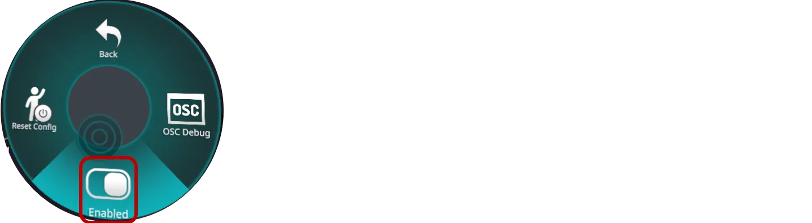

# OSC統合

VRCTはOpen Sound Control（OSC）を使用してVRChatと通信し、ゲーム内チャットボックスへのメッセージ送信などの機能を実現します。

## 概要

OSC（Open Sound Control）は、音声シンセサイザー、コンピュータ、および他のマルチメディアデバイスをネットワーク化するためのプロトコルです。VRChatはOSCを使用して、VRCTなどの外部アプリケーションがゲームと対話できるようにします。

## OSCが有効にする機能

OSC統合を通じて、VRCTは以下のことができます：
- 翻訳されたメッセージをVRChat chatboxに送信
- マイクミュートステータスのVRChatパラメータと対話

## VRChat OSCセットアップ

### VRChatでOSCを有効化

1. VRChatを起動
2. アクションメニューを開く（キーボードのRキー、またはQuestコントローラーのBキーを長押し）
3. **オプション** → **OSC**に移動  
  
4. **OSC**を有効化  
  

:::info[情報]
OSC設定はVRChatセッション間で保持されるため、1回だけ有効にする必要があります。
:::

### OSC構成をリセット

問題が発生した場合：
1. VRChatのアクションメニューで**オプション** → **OSC**に移動
2. **Reset Config**をクリック
3. VRChatを再起動
4. OSCを再度有効にする

## VRCT OSC構成

VRCTはVRChatのデフォルトOSC設定で動作するようにプリセットされています。

### デフォルト設定

- **OSC IP Address**: 127.0.0.1（ローカルホスト）
- **OSC Port**: 9000（VRChatデフォルト受信ポート）
- **OSC Protocol**: UDP

:::warning[警告]
標準的な使用に基づいて、これらの設定を変更する必要は通常ありません。
:::

### カスタム構成

OSC設定を変更する必要がある場合：

1. VRCTコンフィグウィンドウを開く
2. **OSC**または**詳細設定**セクションに移動
3. OSCパラメータを構成
4. 保存してVRCTを再起動

詳細なOSC構成については、[詳細コンフィグガイド](/docs/config-advanced)を参照してください。

## トラブルシューティング

### メッセージがVRChatに表示されない

1. **VRChat OSCが有効になっているか確認**
   - アクションメニュー → オプション → OSC を開く
   - OSCとChatboxが有効になっているか確認

2. **VRCTが実行中であることを確認**
   - VRCTはVRChat実行前または実行中に実行する必要があります
   - VRCTがエラーメッセージを表示していないか確認

3. **ファイアウォール設定を確認**
   - WindowsファイアウォールがVRCTとVRChatの通信を許可しているか確認
   - ポート9000でのUDPトラフィックを許可

4. **両方のアプリケーションを再起動**
   - VRChatとVRCTを閉じる
   - VRChatから開始
   - その後VRCTを開始
   - VRChatでOSCを再度有効にする

5. **OSC構成をリセット**
   - VRChatでOSC構成をリセット
   - 両方のアプリケーションを再起動

### OSC接続の問題

**ネットワーク設定を確認**
- アンチウイルス/セキュリティソフトウェアがOSCをブロックしていないか確認
- テスト用にファイアウォールを一時的に無効化

**OSC接続をテスト**
- OSCデバッグツールを使用して接続を確認
- VRCTログでOSCエラーを確認

## パフォーマンス

OSC通信は非常に軽量です：
- 最小限のCPU使用率
- 低いネットワーク帯域幅
- VRChatパフォーマンスへの影響なし

## 関連機能

- [メッセージ送信](./send-message) - OSC経由でメッセージを送信する方法を学ぶ
- [VRC ミュート同期](./vrc-mute-sync) - OSC経由でミュートステータスを同期
- [詳細設定](/docs/config-advanced) - OSCパラメータを構成
