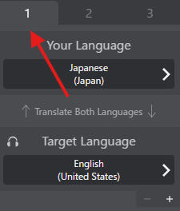

# 言語プリセット

言語プリセットを使用すると、よく使う言語組み合わせを保存し、簡単に切り替えることができます。最大3つのプリセットを設定できます。

## 概要

毎回言語を手動で選択する代わりに、以下を実行できます：
- よく使う言語組み合わせをプリセットとして保存
- 1回のクリックでプリセット間を切り替え
- 各プリセットに異なる翻訳エンジンを構成

これは異なる言語グループと定期的にコミュニケーションを取る場合に特に便利です。

## 使い方

### プリセットタブ

メインウィンドウに3つのプリセットタブが表示されます：
- **プリセット1**
- **プリセット2**
- **プリセット3**

### プリセットを切り替え

1. いずれかのプリセットタブ（1、2、または3）をクリック
2. VRCTは直ちにそのプリセットの言語構成に切り替わる
3. すべての言語設定と翻訳エンジンが自動的に更新される

:::tip[ヒント]
現在アクティブなプリセットはハイライトされます。
:::

## プリセットの構成

### アクティブ中に構成

1. 構成したいプリセットに切り替え
2. 希望の言語を設定：
   - あなたの言語
   - 対象言語
   - 翻訳エンジン
3. プリセットは構成を自動的に保存

## プリセット構成

各プリセットは以下を保存できます：
- **あなたの言語**: あなたが話す/タイプする言語
- **対象言語**: 最大3つの対象言語
- **翻訳エンジン**: 各対象言語に異なるエンジン
- **追加設定**: プリセット固有の翻訳設定

## ユースケース

### 例1：国際的なコミュニティ

異なるVRChartコミュニティに頻繁に訪問する場合：

- **プリセット1**: 英語 → 日本語（JPコミュニティ用）
- **プリセット2**: 英語 → 韓国語（KRコミュニティ用）
- **プリセット3**: 英語 → スペイン語（ESコミュニティ用）

### 例2：多言語友人グループ

- **プリセット1**: 英語 → 日本語 + 韓国語（アジアの友人向け）
- **プリセット2**: 英語 → スペイン語 + フランス語（ヨーロッパの友人向け）
- **プリセット3**: 日本語 → 英語（逆翻訳）

## ベストプラクティス

### コンテキストで整理

1. **コミュニティベース**: 訪問するVRChartコミュニティごとに1つのプリセット
2. **言語ベース**: 主要言語ペアごとに1つのプリセット
3. **目的ベース**: カジュアルチャット、真剣な議論

### プリセットをテスト

構成後：
1. プリセット間を切り替え
2. サンプルメッセージで各プリセットをテスト
3. 言語とエンジンが正しいことを確認

## トラブルシューティング

### 言語が切り替わらない

- プリセットタブをクリックしたか確認
- 言語インジケータが更新されたか確認
- プリセットがスタックしたように見える場合はVRCTを再起動

### 翻訳エンジンが変更されない

- 一部のエンジンはAPIキーを最初に構成する必要があります
- エンジンが言語ペアで利用可能か確認
- インターネット接続を確認（クラウドエンジンの場合）

## 関連機能

- [リアルタイム翻訳](./translation) - 翻訳の基本を学ぶ
- [複数の対象言語](./multi-target-language) - 複数言語を使用
- [翻訳エンジン](./translation-engines) - エンジンを構成
- [ホットキー](/docs/config-hotkeys) - プリセット用のキーボードショートカットを設定
