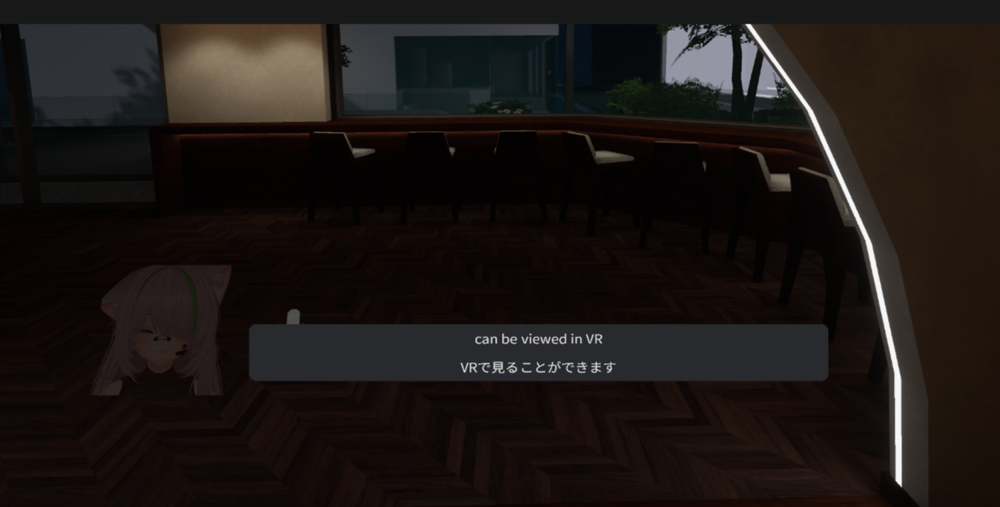
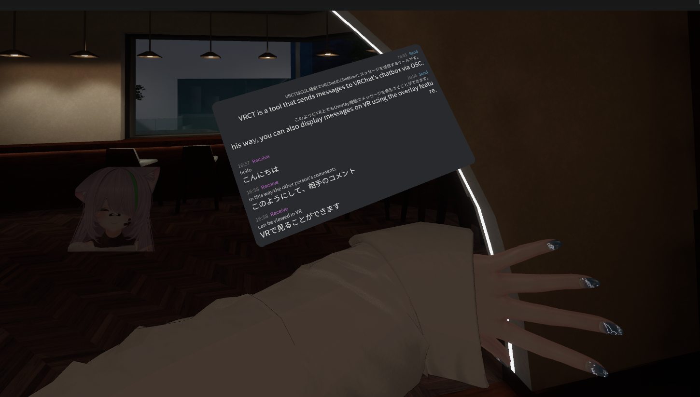

# オーバーレイモード（VR）

オーバーレイモードを使用すると、VRCTインターフェースをVR内に直接オーバーレイとして表示でき、VRでVRChatをプレイしている間に翻訳とチャット履歴を表示しやすくなります。

## 概要

VRでVRChatを使用するときは、以下のことができます：
- VRヘッドセット内でVRCTインターフェースを表示
- オーバーレイウィンドウを位置調整とサイズ変更
- VRを離れずに翻訳を読む

### シングルラインモードとマルチラインモード
- **シングルラインモード**: 一度に1行のテキストを表示して素早く確認（受信メッセージのみ表示）  

- **マルチラインモード**: より多くのコンテキストのために複数行のテキストを表示  

## 有効にする方法

### オーバーレイを有効化

1. オーバーレイコンフィグウィンドウで、**シングルライン**または**マルチライン**の**有効化**トグルをクリック
2. **オーバーレイにサンプルテキストを送信**ボタンをクリックしてVRでオーバーレイをテスト
3. 必要に応じて位置と設定を調整

オーバーレイ設定へのアクセスについては、[VRコンフィグガイド](/docs/config-vr)または[メインウィンドウのVRオーバーレイ設定](/docs/main-window#オーバーレイvrボタン)ドキュメントを参照してください。

## オーバーレイ設定

### 位置とサイズ

**位置**：
- VR空間でオーバーレイ位置を設定するX、Y、Z座標

**回転**：
- ピッチ、ヨー、ロールを調整してオーバーレイを向ける

### トラッキング

**ヘッドロック（HMD）**：
- オーバーレイがあなたの頭の動きに従う
- 常にあなたの視界に表示される
- 継続的な監視に適している

**リストロック（左手または右手）**：
- オーバーレイがあなたの手首に取り付けられる
- 手を上げるときに表示される
- 素早い確認に便利

### 不透明度

- オーバーレイの透明度を調整
- 不透明度が高い：読みやすいが、より邪魔
- 不透明度が低い：邪魔が少ないが、読みにくい
- あなたに合ったバランスを見つけてください

## UI スケーリング
- オーバーレイ要素のサイズを調整して読みやすくする

## 表示時間
- オーバーレイが相互作用後に表示される時間を設定

## フェードアウト時間
- オーバーレイが非使用時にフェードアウトする時間を設定
- 0に設定された場合、オーバーレイは非ゼロ数に変更するまで表示されたままになります

## VRでオーバーレイを使用

### 翻訳を読む

1. Speaker2Logを有効にして音声を文字起こし
2. オーバーレイで文字起こしされたテキストと翻訳されたテキストを表示
3. VRChatでのやりとりを続けながら読む

### メッセージ送信

1. Voice2Chatboxを有効にする
2. マイクに話しかける
3. メッセージは自動的にchatboxに送信される

## VRヘッドセット互換性

### テスト済みヘッドセット

- Meta Quest 2
- Meta Quest 3
- Pico 4

:::info[情報]
オーバーレイ機能はSteamVRまたは互換性のあるVRランタイムが必要です。
:::

## パフォーマンス考慮事項

### システムリソース

オーバーレイモードは追加リソースが必要です：
- VRオーバーレイのGPUレンダリング
- SteamVRオーバーレイシステム
- VRChatパフォーマンスにわずかに影響する可能性

## ベストプラクティス

### 位置決め

1. **異なる位置をテスト**: あなたのプレイスタイルに最適な位置を見つける
2. **中央ビューを避ける**: 重要なゲーム要素をブロックしない
3. **素早く確認**: 翻訳を素早くチェックできる場所に位置決め

### 読みやすさ

1. **十分なサイズ**: テキストが快適に読める大きさにする
2. **適切な距離**: 近すぎない（焦点が難しい）または遠すぎない（読みにくい）

### ワークフロー

1. **必要なときに有効化**: 会話が必要なときにオーバーレイをオン
2. **必要なときは無効化**: アクティビティやイベント中はオフ

## トラブルシューティング

### オーバーレイが表示されない

- SteamVRが実行中であることを確認
- VRヘッドセットが正しく接続されているか確認
- VRCTとSteamVRを再起動
- 設定でオーバーレイが有効になっているか確認

### VRChatでオーバーレイが表示されない

- オーバーレイ距離と位置設定を確認
- 不透明度が十分に高いか確認
- オーバーレイ位置をリセットしてみる
- SteamVRオーバーレイ権限を確認

### テキストが読みにくい

- フォントサイズを増やす
- オーバーレイ距離を調整（近づける）

## 関連機能

- [メインウィンドウの概要](/docs/main-window) - メインインターフェースについて学ぶ
- [スピーカーからテキスト](./speaker-to-text) - VRで音声を文字起こし
- [VR設定](/docs/config-vr) - VRオーバーレイオプションを構成
- [外観のカスタマイズ](./appearance) - オーバーレイの外観をカスタマイズ
