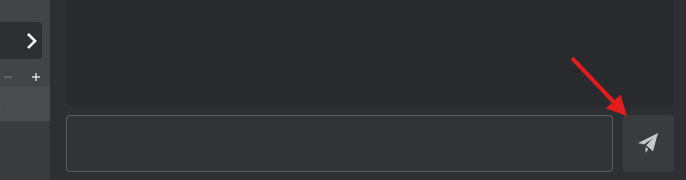

# メッセージ送信

VRCTを使用してメッセージを翻訳付きで送信する方法を学びます。  
メッセージはテキスト入力または音声入力で送信でき、翻訳されてVRChat chatboxに送信されます。

## 概要

VRCTは複数のメッセージ送信方法を提供しています：
1. **テキスト入力**：メッセージを直接タイプ
2. **音声入力**：マイクに話しかける
3. 両方の方法はリアルタイム翻訳をサポート

## テキスト入力方法

### 基本的なテキスト送信

1. メインウィンドウの下にある入力フィールドを探す
2. 入力フィールド内をクリック  

3. メッセージをタイプ
4. **Enterキー**を押すか、**メッセージ送信**ボタンをクリック  

### キーボードショートカット

- **Enter**: メッセージを送信
- **Shift + Enter**: 行改行を挿入（複数行メッセージ）
- **Shift + 上矢印**: 編集用に前回送信したメッセージを呼び出す
- **Shift + 下矢印**: メッセージ履歴を順方向に移動（利用可能な場合）

:::tip[ヒント]
**Shift + 上矢印**を押して前回送信したメッセージを呼び出し、変更を加えて、再送信することで以前のメッセージを編集できます。
:::

### 翻訳と共に

1. **翻訳**トグルを有効にする
2. **あなたの言語**を設定（タイプしている言語）
3. **対象言語**を設定（翻訳したい言語）
4. あなたの言語でメッセージをタイプ
5. Enterキーを押して送信
6. あなたのメッセージは翻訳されてVRChatに送信される

**表示内容**：
- 元のメッセージ（チャット履歴の右側）
- 翻訳されたメッセージ（同様に表示）
- 元のテキストと翻訳の両方がVRChat chatboxに送信される

## 音声入力方法

### Voice2Chatboxを有効化

1. **Voice2Chatbox**トグルをクリックして有効にする
2. 設定でマイクが選択されていることを確認
3. マイクに話しかける
4. 音声がテキストに文字起こしされる
5. メッセージは自動的に処理されて送信される

:::warning[重要]
音声入力を使用する前に、[デバイス設定](/docs/config-device)でマイクを構成してください。
:::

### 音声入力と翻訳

1. **翻訳**トグルを有効にする
2. **Voice2Chatbox**トグルを有効にする
3. **あなたの言語**を話す言語に設定
4. **対象言語**を希望の翻訳言語に設定
5. マイクに話しかける
6. 音声 → 文字起こし → 翻訳 → VRChatに送信

### 音声入力のヒント

1. **はっきり話す**: 文字起こしの精度を向上
2. **適切な速度**: 遅すぎず、早すぎず
3. **ノイズを減らす**: バックグラウンドサウンドを最小化
4. **文の間で一時停止**: 句読点と処理に役立つ

詳細については、[音声からテキストガイド](./voice-to-text)を参照してください。

## 翻訳オプション

### 複数の対象言語

複数の言語で同時に翻訳を送信：

1. 対象言語の横にある**[+]**ボタンをクリック
2. 追加の言語を選択（最大3つ）
3. メッセージをタイプまたは話す
4. すべての翻訳が一緒に送信される

詳細については、[複数の対象言語ガイド](./multi-target-language)を参照してください。

### 翻訳エンジンを選択

あなたのニーズに最適な翻訳エンジンを選択：

1. 対象言語の下の翻訳エンジン名をクリック
2. 利用可能なエンジンから選択（Google、DeepL、AI翻訳など）
3. あなたのメッセージは選択されたエンジンを使用する

詳細については、[翻訳エンジンガイド](./translation-engines)を参照してください。

## メッセージ表示

### チャット履歴

送信後、メッセージはチャット履歴に表示される：
- **右側**：送信したメッセージ
- 元のテキストが表示される
- 翻訳されたテキストが表示される
- タイムスタンプ（有効な場合）

### VRChat Chatbox

翻訳されたメッセージが表示される：
- VRChat chatboxであなたのアバターの上に表示
- 近くのプレイヤーに表示
- 数秒後に自動的に消える

## メッセージのフォーマット

### 複数行メッセージ

複数行メッセージを作成：
1. 最初の行をタイプ
2. **Shift + Enter**を押して行改行を追加
3. 次の行をタイプ
4. 必要に応じて繰り返す
5. **Enter**を押して送信

:::info[注意]
VRChat chatboxは表示文字数に制限があります。非常に長いメッセージは切り詰められる可能性があります。
:::

## VRChat統合

### OSC接続

メッセージはOSC（Open Sound Control）経由でVRChatに送信される：

1. VRChat OSCが有効になっていることを確認
2. VRCTが自動的に接続
3. メッセージがリアルタイムでchatboxに送信される

OSCセットアップについては、[OSC連携ガイド](./osc-integration)を参照してください。

### 文字数制限

VRChat chatboxは**144文字の制限**がある：
- VRCTは自動的に切り詰め処理
- 長いメッセージが切断される可能性
- 元のテキストを優先（翻訳されたテキストのみを表示することもできます）

## ベストプラクティス

### より良い翻訳のために

1. **シンプルな文を使用**: 翻訳がより正確
2. **スラングを避ける**: 翻訳されない可能性
3. **適切なエンジンを選択**: 異なるエンジンで異なる品質

### VRChatコミュニケーションのために

1. **メッセージを簡潔に**: 文字制限を尊重
2. **一度に1つの考え**: 読みやすい
3. **適切な言語を使用**: コミュニティに合わせる
4. **辛抱強く**: 翻訳と送信に時間を見当する

### 音声入力のために

1. **自然に話す**: 自然な音声が最適に機能
2. **メッセージ間で一時停止**: 処理時間を確保
3. **マイクを調整**: 適切な距離と音量

## トラブルシューティング

### メッセージが送信されない

- 翻訳を使用している場合、翻訳トグルがオンか確認
- VRChat OSCが有効になっているか確認
- VRCTがVRChatに接続されているか確認
- VRCTのエラーメッセージを確認

### 翻訳が機能しない

- 翻訳エンジンが選択されているか確認
- インターネット接続を確認（クラウドエンジンの場合）
- 言語が正しく設定されているか確認
- 別の翻訳エンジンを試す

### 音声入力が機能しない

- 設定でマイクが選択されているか確認
- Voice2Chatboxトグルが有効になっているか確認
- Windowsの設定でマイクをテスト
- マイク権限を確認

### メッセージがVRChatに表示されない

- VRChat chatboxが有効になっているか確認
- OSC設定を確認
- VRChatとVRCTを再起動
- OSCポートが正しいか確認（デフォルト9000）

より多くのトラブルシューティングについては、[FAQ](/docs/faq)を参照してください。

## 関連機能

- [メッセージ受信](./receive-message) - メッセージ受信について学ぶ
- [音声からテキスト](./voice-to-text) - 詳細な音声入力ガイド
- [リアルタイム翻訳](./translation) - 翻訳機能の概要
- [OSC連携](./osc-integration) - VRChat接続セットアップ
- [複数の対象言語](./multi-target-language) - 複数言語で送信
