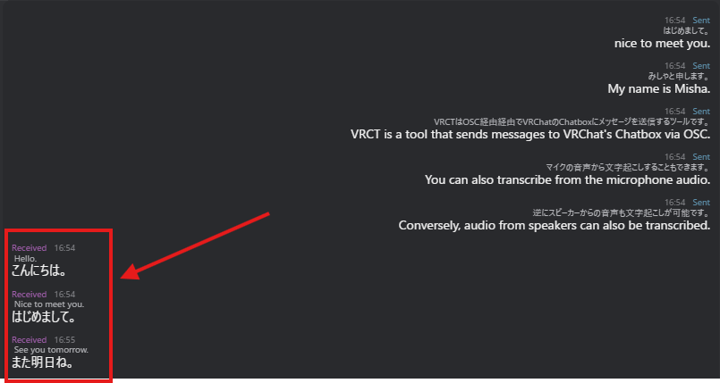

# メッセージ受信

VRCTのスピーカー文字起こし機能を使用してVRChartの他のプレイヤーからメッセージを受信して翻訳する方法を学びます。

## 概要

VRCTはスピーカーから音声をキャプチャして以下を実行できます：
1. オーディオをテキストに文字起こし
2. 文字起こしされたテキストを翻訳
3. チャット履歴に表示して読む

これにより、音声チャットを通じて他のプレイヤーが言っていることを「読む」ことができます（異なる言語でも）。

## スピーカー文字起こしを有効化

### Speaker2Logを切り替え

1. メインウィンドウで**Speaker2Log**トグルスイッチを探す
2. クリックしてスピーカー文字起こしを有効にする
3. 設定で正しいスピーカー/オーディオデバイスが選択されていることを確認

:::warning[重要]
有効にする前に、[デバイスコンフィグ](/docs/config-device)で正しいスピーカー/オーディオ出力デバイスが選択されていることを確認してください。
:::

## コンフィグレーション

### オーディオ出力デバイスを選択

1. コンフィグウィンドウを開く（ギアアイコンをクリック）
2. **デバイス**タブに移動
3. VRChatが使用しているオーディオ出力デバイスを選択
4. 設定を保存

:::tip[ヒント]
VRChat音声チャット音声を再生するものと同じデバイスを選択してください。
:::

詳細なデバイス構成については、[デバイスコンフィグガイド](/docs/config-device)を参照してください。

### 文字起こしを構成

1. コンフィグウィンドウを開く
2. **文字起こし**タブに移動
3. スピーカー文字起こしエンジンを構成
4. 言語設定を調整
5. 変更を保存

詳細な文字起こし設定については、[文字起こしコンフィグガイド](/docs/config-transcription)を参照してください。

## メッセージ受信

### 翻訳なし

1. **Speaker2Log**トグルを有効にする
2. VRChat音声チャットで誰かが話すとき
3. VRCTが音声をキャプチャして文字起こし
4. 文字起こしされたテキストがチャット履歴（左側）に表示される

### 翻訳と共に

1. **翻訳**と**Speaker2Log**の両方のトグルを有効にする
2. 予想される元の言語を設定（彼らが話す言語）
3. 希望する対象言語を設定（あなたの言語）
4. 誰かが話すとき：
   - 音声はテキストに文字起こしされる
   - テキストは自動的にあなたの言語に翻訳される
   - 元のテキストと翻訳がチャット履歴に表示される

## メッセージ表示

### チャット履歴のレイアウト

受信したメッセージはチャット履歴の**左側**に表示される：

- **元のテキスト**：元の言語で文字起こしされた音声
- **翻訳されたテキスト**：あなたの言語への翻訳
- **タイムスタンプ**：メッセージが受信されたとき（有効な場合）

### メッセージを読む

- メッセージは他のプレイヤーが話しながらリアルタイムで表示される
- スクロールして古いメッセージを表示

## 手動言語選択

精度を向上させるには、予想される元の言語を手動で設定します：

1. その人が話している言語を知る
2. それをVRCTの元の言語として設定
3. より正確な文字起こしと翻訳

## 複数スピーカーシナリオ

### 複数人が話している場合

複数人が話しているとき：
- 必要に応じて複数の対象言語を選択
- VRCTはスピーカーデバイスから入手可能な言語のすべての音声を文字起こし
- 文字起こしが混在する可能性
- 異なるスピーカーを分離するのは困難
- 1人が話すときが最適

### 同時音声

複数人が同時に話すとき：
- 文字起こし精度が低下
- 混合または不明瞭なテキストの可能性
- 翻訳が信頼性を欠く可能性
- クリアな音声を待つと結果が良好

## 重要な警告

### デバイス変更警告

:::warning[重要]
**Speaker2Logがアクティブな状態でWindowsのスピーカーデバイスを変更しないでください。**

スピーカーデバイスを変更する必要がある場合：
1. **VRCTで最初にSpeaker2Logを無効化**
2. Windowsでスピーカーデバイスを変更
3. VRCT設定のデバイスを更新
4. Speaker2Logを再度有効化

アクティブな状態でデバイスを変更するとVRCTが凍結またはクラッシュする可能性があります。
:::

### プライバシー考慮事項

スピーカー文字起こしはすべての音声を選択したデバイスから文字起こしすることに注意してください：
- VRChat音声チャット
- 音楽またはビデオ
- 他のアプリケーションサウンド
- デスクトップ通知

**責任を持って倫理的に使用してください：**
- 他人のプライバシーを尊重
- 許可なく個人的な会話を共有しない
- VRChatコミュニティガイドラインに従う
- アクセシビリティとコミュニケーション支援のみに使用

## ユースケース

### アクセシビリティ

- 聴覚障害のあるプレイヤー向け
- 音声チャットをテキストで読む
- 重要な会話を見落とさない
- VRChatコミュニティに完全に参加

### 言語横断コミュニケーション

- 異なる言語を話すプレイヤーを理解
- 国際的な世界で言語障壁を橋渡け
- グローバルVRChatコミュニティと通信
- 言語の境界を超えて友達を作る

### 記録管理

- 音声会話の書面による記録
- 後で重要な情報を確認
- 何が議論されたかを覚える
- 会話アーカイブを作成

## ベストプラクティス

### より良い文字起こしのために

1. **高い音声品質**: クリアなVRChat音声を確保
2. **適切な音量**: 大きすぎず、小さすぎず
3. **バックグラウンドノイズを減らす**: 他のアプリケーション音声を最小化
4. **正しい言語設定**: 予想される元の言語を設定

### より良い翻訳のために

1. **適切なエンジンを選択**: 言語ペアで優れたエンジンを選択
2. **コンテキスト認識**: 会話コンテキストを理解

### VRChatエチケット

1. **控えめに使用**: 文字起こししていることを宣言しない
2. **プライバシーを尊重**: 許可なく転記を共有しない
3. **他人を支援**: 翻訳を共有してコミュニケーションを支援

## トラブルシューティング

### 文字起こしが表示されない

- Speaker2Logトグルが有効になっているか確認
- 正しいオーディオデバイスが選択されているか確認
- VRChat音声がそのデバイスを通じて再生されているか確認
- Windowsでオーディオ出力をテスト
- マイクをキャプチャしていないか確認

### 文字起こし品質が低い

- VRChat音声を増加
- 他のアプリケーション音声を減らす
- 正しい元の言語が設定されているか確認
- 別の文字起こしエンジンを試す
- オーディオデバイス品質とドライバをチェック

### 翻訳が正確でない

- 正しい元の言語と対象言語を確認
- 別の翻訳エンジンを試す
- 文字起こしが正確であることを最初に確認
- コンテキストとスラング使用を考慮
- 重要なメッセージの場合は手動翻訳

### VRCTが凍結している

- オーディオデバイスを変更する前にSpeaker2Logを無効化
- 凍結した場合はVRCTを再起動
- システムリソースを確認（CPU/GPU/RAM）
- VRCTを最新版にアップデート

### VRChat音声が聞こえない

- オーディオデバイスがミュートされていないか確認
- Windowsボリュームミキサーを確認
- VRChatが正しいデバイスに出力されているか確認
- 他のアプリケーションでオーディオをテスト

## パフォーマンス最適化

### システムリソース

スピーカー文字起こしはリソース集約的です：
- 継続的なオーディオ処理
- リアルタイム文字起こし
- 翻訳処理
- マイク文字起こしより要求が多い

### 最適化のヒント

1. **軽い文字起こしモデルを使用**: より高速なエンジンを選択
2. **不要なアプリを削減**: 不要なアプリケーションを閉じる
3. **必要なときだけ無効化**: 使用していないときはオフに
4. **設定を最適化**: 品質とパフォーマンスのバランスを取る

## プライバシーとエシックス

### 倫理的使用

- 他人のプライバシーと同意を尊重
- 正当なコミュニケーション目的に使用
- 許可なく共有しない
- VRChat利用規約に従う

### データハンドリング

- 文字起こしはVRCTにローカルで保存される
- クラウドエンジンはオーディオを外部サーバーに送信する可能性
- プライバシーのためにローカルエンジンを選択

### 法的考慮事項

- 会話録音に関する地域法を確認
- 一部の地域は録音に同意が必要
- VRCT文字起こしはこれらの法律の対象となる可能性
- 責任を持ってそして合法的に使用

## 関連機能

- [メッセージ送信](./send-message) - メッセージ送信について学ぶ
- [スピーカーからテキスト](./speaker-to-text) - 詳細なスピーカー文字起こしガイド
- [リアルタイム翻訳](./translation) - 翻訳機能の概要
- [デバイスコンフィグ](/docs/config-device) - オーディオデバイスを構成
- [文字起こしコンフィグ](/docs/config-transcription) - 文字起こしエンジンを構成
