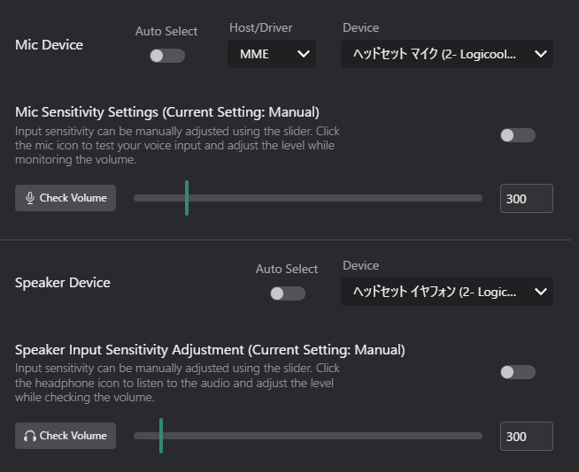
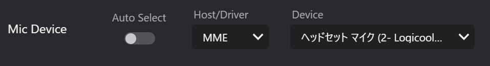
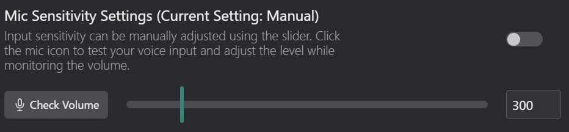
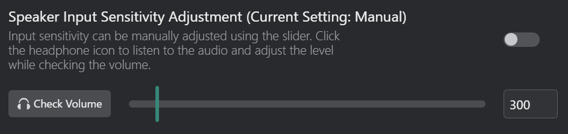

# デバイスタブ
オーディオ入力および出力デバイスをカスタマイズします。  

## マイクデバイス
音声入力用のマイクを選択します。

- **自動選択**：デフォルトのシステムマイクを自動的に選択します。
- **ホスト/ドライバ**：リストから特定のマイクを手動で選択します。
    - **ホスト**：オーディオホスト（例：MME、WASAPI、DirectSound）。
- **デバイス**：選択されたホスト下で利用可能な特定のマイクデバイス。

- **トグルスイッチ**：自動マイク感度調整を有効または無効にします。
- **音量を確認**：マイクの現在の感度レベルを表示します。
    
- **音量スライダー**：マイク感度レベルを手動で調整します。
    - 自動調整が有効な場合、このスライダーは無効になります。

## スピーカーデバイス
翻訳する音声を受信するためにスピーカーまたはヘッドフォンを選択します。

- **自動選択**：デフォルトのシステムスピーカーを自動的に選択します。
- **デバイス**：選択されたホスト下で利用可能な特定のスピーカーデバイス。
    - スピーカーホスト/ドライバはWASAPIのみです。変更できません。
- **再生中の音声エンドポイントを自動追従**（v3.5.0〜）：ピークレベルを監視し、実際に音が鳴っている出力デバイスへ自動的に切り替えます。ゲームや通話の音声出力先が切り替わっても、手動でスピーカーデバイスを選び直す必要がなくなります。

{/* TODO(v3.5.0): replace with ./img/config-device-speaker-follow-endpoint.png */}

:::note[v3.5.0]
音声処理の安定性が大幅に見直され、デバイス切り替え時のハングやスピーカーループバックの誤検知が解消されました。ストールした音声ストリームからは自動で復帰します。
:::

- **トグルスイッチ**：自動スピーカー音量調整を有効または無効にします。
- **音量を確認**：スピーカーの現在の音量レベルを表示します。
    
- **音量スライダー**：スピーカー音量レベルを手動で調整します。
    - 自動調整が有効な場合、このスライダーは無効になります。
