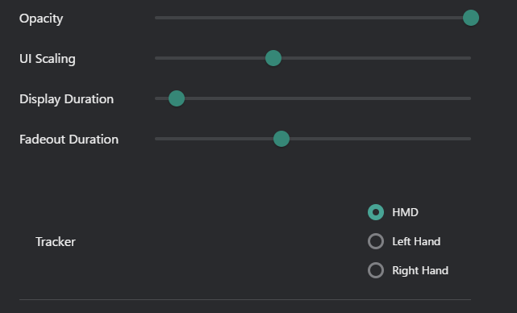
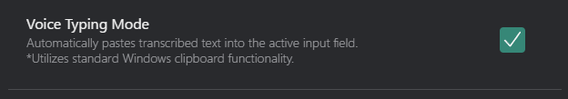

# VRタブ
コンフィグウィンドウのVRタブでVR設定をカスタマイズします。

## オーバーレイ概要

  <iframe
    src="https://www.youtube.com/embed/uR6cHKFnjSQ"
    title="Overlay Video"
    style={{ position: 'absolute', top: 0, left: 0, width: '100%', height: '100%', border: 0 }}
    allow="accelerometer; autoplay; clipboard-write; encrypted-media; gyroscope; picture-in-picture; web-share"
    allowFullScreen
  />

### オーバーレイを有効化

- **シングルライン / マルチライン**: シングルラインまたはマルチラインオーバーレイ表示を選択します。
    - **シングルライン**: 一度に1行のテキストを表示します。
    - **マルチライン**: 複数行のテキストを同時に表示します。

### オーバーレイ位置と回転コントロール
- **位置コントロール**: 画面上のオーバーレイ位置を調整します。
    - 矢印ボタンを使用してオーバーレイを上、下、左、または右に移動します。

- **回転コントロール**: オーバーレイ表示を回転します。
    - 回転ボタンを使用してオーバーレイを時計回りまたは反時計回りに回転します。

### オーバーレイウィンドウ設定

- **不透明度**: オーバーレイの透明度を調整します。
    - スライダーを移動して、目的の不透明度レベルを設定します（0%～100%）。
- **UIスケーリング**: オーバーレイUI要素のサイズを調整します。
    - スライダーを移動してUI スケーリング割合を増加または減少させます。
- **表示時間** ：オーバーレイが表示されたままの期間を設定します。
    - スライダーを移動して表示期間を秒単位で設定します。
- **フェードアウト時間** ：オーバーレイがフェードアウトする期間を設定します。
    - スライダーを移動してフェードアウト期間を秒単位で設定します。
- **トラッカー**: オーバーレイウィンドウトラッキング設定。
    - **HMD**: 選択すると、オーバーレイはHead-Mounted Display（HMD）の位置に従います。
    - **左手**: 選択すると、オーバーレイは左コントローラーの位置に従います。
    - **右手**: 選択すると、オーバーレイは右コントローラーの位置に従います。

### 共通設定

- **翻訳されたメッセージのみを表示**: 有効にすると、翻訳されたメッセージのみがオーバーレイに表示されます。

## 音声タイピングモード

音声タイピングモードを有効にすると、文字起こしされた音声が自動的にクリップボードにコピーされ、アクティブなVRアプリケーションにペーストされます。

### 音声タイピングモードを有効化

- **音声タイピングモードを有効にする** (チェックボックス)
  - 音声文字起こしが自動的にクリップボードにコピーされ、アクティブなVRアプリケーションにペーストされます

:::note[注釈]
音声タイピングモードはVRで実行している場合のみ動作します。デスクトップモードではクリップボードへのコピー・ペーストは実行されません。
:::

### 音声タイピングモードの仕組み

1. マイクに話しかけます（Voice2Chatbox有効時）
2. 音声がテキストに文字起こしされます
3. テキストが自動的にシステムクリップボードにコピーされます
4. VRアプリケーションをアクティブにしフォーカスされたテキストフィールドにペーストされます

### 要件

- アクティブなVRセッション（SteamVRまたは互換性のあるVRランタイム）
- Voice2Chatbox有効（マイク文字起こしがアクティブ）
- ターゲットVRアプリケーションがクリップボードペーストをサポート
- [デバイス設定](/docs/config-device)でマイクが正しく設定されていること

### ユースケース

音声タイピングモードは以下の用途に活躍します：
- **VRChatワールド検索**: ワールド名を話して検索
- **日本語入力**: 複雑なIMEセットアップなしで日本語を入力
- **VRChat設定**: 設定メニューでのテキスト入力
- **マルチプレイヤーゲーム**: ヘッドセットを外さずにチャット
- **任意のVRアプリケーション**: クリップボードペーストをサポートする任意のアプリケーションで動作

詳細については [音声タイピングモードガイド](/docs/feature-guide/voice-typing-mode) を参照してください。
