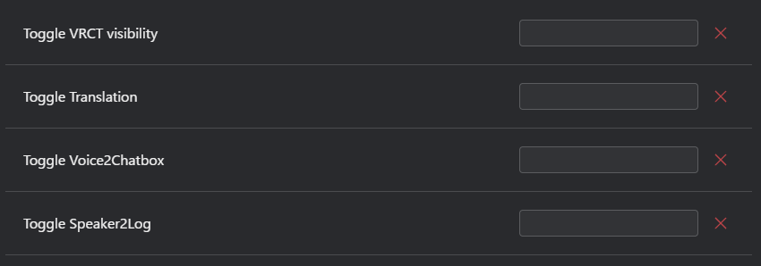

import TwitterEmbed from '@site/src/components/TwitterEmbed';

# ホットキータブ
VRCTコンフィグのホットキータブでさまざまなホットキー設定をカスタマイズします。

## ビデオ

<TwitterEmbed url="https://twitter.com/Shiina_12siy/status/1882028408185712799" />

## 一般

- **VRCT表示を切り替え**: VRCTウィンドウを表示または非表示にするホットキーを設定します。
- **翻訳を切り替え**: 翻訳機能を有効または無効にするホットキーを設定します。
- **Voice2Chatboxを切り替え**: Voice2Chatbox機能を有効または無効にするホットキーを設定します。
- **Speaker2Logを切り替え**: Speaker2Log機能を有効または無効にするホットキーを設定します。
