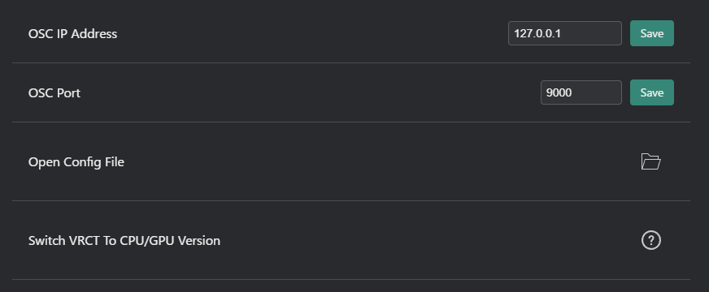
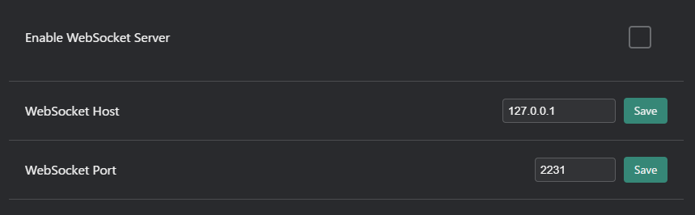

# 詳細設定タブ
VRCTコンフィグの詳細設定タブで詳細オプションを構成します。

## 一般

- **OSC IP Address**: OSC通信用のIPアドレスを設定します。
- **OSCポート**: OSCメッセージ送信用のポート番号を指定します。
- **コンフィグファイルを開く**: 手動編集用のVRCTコンフィグファイルを開きます。
- **VRCTをCPU/GPUバージョンに切り替え**: VRCTのCPUまたはGPU処理を選択します。必要なファイルがダウンロードされ、版が切り替わります。
    - v3.5.0以降は、[インストール](/docs/installation)時にもGPU版／CPU版を選択できます。

## WebSocket

- **WebSocketサーバーを有効にする**: WebSocket通信を有効または無効にします。
- **WebSocketホスト**: WebSocket通信用のIPアドレスを設定します。
- **WebSocketポート**: WebSocket通信用のポート番号を指定します。

## OBSブラウザソース（v3.5.0〜）

VRCT内蔵のHTTPサーバーで、OBSのブラウザソース用の字幕ページを配信します。

- **OBSブラウザソースを有効にする**: 内蔵HTTPサーバーを起動または停止します。
- **ポート**: 字幕ページを配信するポート番号を指定します。
- **文字色**: ブラウザソースに表示される字幕テキストの色を指定します。

:::note
字幕ページの表示にはWebSocketサーバーが使用されるため、あわせて有効にしてください。設定手順とOBS側の追加方法は[OBSブラウザソース](/docs/feature-guide/obs-browser-source)を参照してください。項目名やデフォルト値はコンフィグウィンドウの表示に従ってください。
:::

{/* TODO(v3.5.0): replace with ./img/config-advanced-obs.png */}

